# 🏛️ **SISTEM PERIZINAN SANTRI - COMPLETE FLOW & API GUIDE**

## 📋 **TABLE OF CONTENTS**
1. [Overview](#overview)
2. [User Roles & Responsibilities](#user-roles--responsibilities)
3. [Complete Workflow](#complete-workflow)
4. [API Consumption by Role](#api-consumption-by-role)
5. [Status Flow](#status-flow)
6. [Authentication](#authentication)
7. [Database Schema](#database-schema)
8. [Testing Guide](#testing-guide)

---

## 🎯 **OVERVIEW**

Sistem perizinan santri pondok pesantren dengan workflow manual yang melibatkan 4 role utama:
- **Admin**: Full system management
- **Mustahiq**: Approve/reject izin santri asuhan
- **Wali**: Create izin request untuk anak
- **Satpam**: Verify pickup & confirm return

**Base URL**: `https://project.linier.my.id/api`

---

## 👥 **USER ROLES & RESPONSIBILITIES**

### **🔑 ADMIN**
**Access Level**: Full system access

**Capabilities**:
- ✅ Manage semua data (User, Mustahiq, Wali, Santri, Satpam)
- ✅ View semua izin dari seluruh santri
- ✅ Dashboard statistics lengkap
- ✅ Filament admin panel access (`/admin`)

**Dashboard Features**:
- Total users by role
- Izin statistics (pending, approved, rejected, completed)
- Recent activities
- System health status

### **📚 MUSTAHIQ (Pengasuh/Ustadz)**
**Access Level**: Santri dalam asuhan mereka

**Capabilities**:
- ✅ View izin santri asuhan saja
- ✅ **Approve/Reject** permohonan izin
- ✅ Provide rejection reason (wajib jika reject)
- ✅ Dashboard stats santri asuhan

**Key Responsibilities**:
- Review kelayakan izin santri
- Memberikan alasan jelas jika menolak
- Monitor perkembangan santri asuhan

### **👨‍👩‍👧‍👦 WALI (Orang Tua/Wali Santri)**
**Access Level**: Anak asuh mereka

**Capabilities**:
- ✅ **Create** permohonan izin untuk anak
- ✅ View status izin anak (pending → approved → picked_up → completed)
- ✅ Dashboard stats anak asuh
- ✅ History izin sebelumnya

**Workflow**:
1. Submit izin request dengan detail lengkap
2. Wait for mustahiq approval
3. Coordinate pickup jika approved
4. Ensure return on time

### **🛡️ SATPAM (Security)**
**Access Level**: Verification process

**Capabilities**:
- ✅ View today's approved pickups
- ✅ **Verify pickup** (1 foto bersama + identity check)
- ✅ **Confirm return** (no photo, confirmation only)
- ✅ View currently out santri
- ✅ Reject pickup jika identitas tidak sesuai

**Security Protocols**:
- Manual identity verification
- Photo documentation for pickup
- Return confirmation tracking

---

## 🔄 **COMPLETE WORKFLOW**

### **PHASE 1: 📝 PERMOHONAN IZIN**

```mermaid
graph LR
    W[👨‍👩‍👧‍👦 WALI] --> CR[Create Request]
    CR --> DB[(Database)]
    DB --> ST[Status: pending]
```


**Process**:
1. Wali login ke system
2. Fill izin form:
   - Santri selection
   - Alasan keluar (keperluan)
   - Tanggal jemput
   - Tanggal kembali
   - Catatan tambahan
3. Submit request
4. Status: `pending`

### **PHASE 2: ✅ APPROVAL PROCESS**


**Process**:
1. Mustahiq receives notification
2. Review izin details:
   - Santri profile
   - Reason for leave
   - Duration & dates
   - Previous izin history
3. Make decision:
   - **Approve**: Status → `approved`
   - **Reject**: Status → `rejected` + rejection_reason

### **PHASE 3: 🚚 PICKUP VERIFICATION**

```mermaid
graph TD
    S[🛡️ SATPAM] --> TP[Today's Pickups]
    TP --> VER[Manual Verification]
    VER --> ID{Identity Check}
    ID -->|✅ Valid| PU[Status: picked_up]
    ID -->|❌ Invalid| REJ[Status: rejected]
    PU --> PHOTO[📸 Foto Bersama]
```


**Process**:
1. Satpam check today's approved pickups
2. When wali arrives:
   - Verify wali identity manually
   - Check against database records
   - Take 1 photo (wali + santri together)
3. Decision:
   - **Verified**: Status → `picked_up`
   - **Rejected**: Status → `rejected` + reason

### **PHASE 4: 🏠 RETURN CONFIRMATION**  

```mermaid
graph LR
    S[🛡️ SATPAM] --> CO[Currently Out]
    CO --> RC[Return Check]
    RC --> CONF[Confirm Return]
    CONF --> COMP[Status: completed]
```


**Process**:
1. Satpam check currently out santri
2. When santri returns:
   - Visual confirmation (no photo needed)
   - Optional notes about condition
   - Update status
3. Status → `completed`

---

## 📱 **API CONSUMPTION BY ROLE**

### **🔑 ADMIN API USAGE**

#### **Login & Authentication**
```javascript
const adminLogin = async () => {
  const response = await fetch('https://project.linier.my.id/api/login', {
    method: 'POST',
    headers: { 'Content-Type': 'application/json' },
    body: JSON.stringify({
      no_hp: '08123456789', // Admin phone
      password: 'admin123'
    })
  });
  
  const data = await response.json();
  if (data.success) {
    localStorage.setItem('auth_token', data.token);
    console.log('Role:', data.role); // 'admin'
  }
};
```

#### **Get All Izin (System-wide)**
```javascript
const getAllIzin = async (token) => {
  const response = await fetch('https://project.linier.my.id/api/izin', {
    headers: { 'Authorization': `Bearer ${token}` }
  });
  
  const data = await response.json();
  if (data.success) {
    console.log('All Izin:', data.data);
    // Returns: All izin from all santri across system
  }
};
```

#### **Dashboard Statistics**
```javascript
const getAdminStats = async (token) => {
  const response = await fetch('https://project.linier.my.id/api/dashboard/stats', {
    headers: { 'Authorization': `Bearer ${token}` }
  });
  
  const data = await response.json();
  // Returns: Complete system statistics
  /*
  {
    "total_users": 150,
    "total_santri": 100,
    "izin_pending": 5,
    "izin_approved": 8,
    "izin_completed": 45,
    "currently_out": 3
  }
  */
};
```

### **📚 MUSTAHIQ API USAGE**

#### **Login & Get Santri Asuhan**
```javascript
const mustahiqLogin = async () => {
  const response = await fetch('https://project.linier.my.id/api/login', {
    method: 'POST',
    headers: { 'Content-Type': 'application/json' },
    body: JSON.stringify({
      no_hp: '08123456001', // Mustahiq phone
      password: 'password123'
    })
  });
  
  const data = await response.json();
  // Role: data.role = 'mustahiq'
};

const getMySantriIzin = async (token) => {
  const response = await fetch('https://project.linier.my.id/api/izin', {
    headers: { 'Authorization': `Bearer ${token}` }
  });
  
  const data = await response.json();
  // Returns: Only izin from santri under this mustahiq
};
```

#### **Approve Izin**
```javascript
const approveIzin = async (token, izinId) => {
  const response = await fetch(`https://project.linier.my.id/api/izin/${izinId}/status`, {
    method: 'PUT',
    headers: { 
      'Authorization': `Bearer ${token}`,
      'Content-Type': 'application/json'
    },
    body: JSON.stringify({
      status: 'approved',
      notes: 'Izin disetujui, santri sudah menyelesaikan tugas hafalan'
    })
  });
  
  const data = await response.json();
  if (data.success) {
    console.log('Izin approved:', data.data);
  }
};
```

#### **Reject Izin**
```javascript
const rejectIzin = async (token, izinId, reason) => {
  const response = await fetch(`https://project.linier.my.id/api/izin/${izinId}/status`, {
    method: 'PUT',
    headers: { 
      'Authorization': `Bearer ${token}`,
      'Content-Type': 'application/json'
    },
    body: JSON.stringify({
      status: 'rejected',
      rejection_reason: reason // WAJIB untuk rejection
    })
  });
  
  const data = await response.json();
  if (data.success) {
    console.log('Izin rejected:', data.data);
  }
};

// Example rejection reasons:
const rejectionReasons = [
  'Santri belum menyelesaikan tugas hafalan',
  'Masih dalam masa tahfidz intensif',
  'Belum menyelesaikan piket harian',
  'Nilai akademik belum mencukupi',
  'Sedang dalam proses bimbingan khusus'
];
```

### **👨‍👩‍👧‍👦 WALI API USAGE**

#### **Login & Create Izin Request**
```javascript
const waliLogin = async () => {
  const response = await fetch('https://project.linier.my.id/api/login', {
    method: 'POST',
    headers: { 'Content-Type': 'application/json' },
    body: JSON.stringify({
      no_hp: '08123456101', // Wali phone
      password: 'password123'
    })
  });
  
  const data = await response.json();
  // Role: data.role = 'wali'
};
```

#### **Create Izin Request**
```javascript
const createIzinRequest = async (token, izinData) => {
  const response = await fetch('https://project.linier.my.id/api/create-izin', {
    method: 'POST',
    headers: { 
      'Authorization': `Bearer ${token}`,
      'Content-Type': 'application/json'
    },
    body: JSON.stringify({
      santri_id: izinData.santri_id,
      
      // Database fields (recommended)
      alasan: izinData.alasan,
      tanggal_jemput: izinData.tanggal_jemput,
      tanggal_kembali: izinData.tanggal_kembali,
      catatan: izinData.catatan,
      
      // OR API-compatible fields (alternative)
      keperluan: izinData.keperluan,           // → alasan
      tanggal_keluar: izinData.tanggal_keluar, // → tanggal_jemput
      sampai_tanggal: izinData.sampai_tanggal, // → tanggal_kembali
      keterangan: izinData.catatan          // → catatan
    })
  });
  
  const data = await response.json();
  if (data.success) {
    console.log('Izin created:', data.data);
    // Status will be 'pending'
  }
};

// Example usage
const exampleIzin = {
  santri_id: 1,
  alasan: 'Acara pernikahan saudara',
  tanggal_jemput: '2025-07-30',
  tanggal_kembali: '2025-08-02',
  catatan: 'Mohon dipersiapkan seragam untuk acara formal'
};

createIzinRequest(token, exampleIzin);
```

#### **Monitor Izin Status**
```javascript
const getMyChildIzin = async (token) => {
  const response = await fetch('https://project.linier.my.id/api/izin', {
    headers: { 'Authorization': `Bearer ${token}` }
  });
  
  const data = await response.json();
  // Returns: Only izin from this wali's children
  
  data.data.forEach(izin => {
    console.log(`Izin #${izin.id}: ${izin.status}`);
    if (izin.status === 'rejected') {
      console.log(`Rejection reason: ${izin.rejection_reason}`);
    }
  });
};

const checkSpecificIzin = async (token, izinId) => {
  const response = await fetch(`https://project.linier.my.id/api/izin/${izinId}`, {
    headers: { 'Authorization': `Bearer ${token}` }
  });
  
  const data = await response.json();
  if (data.success) {
    const izin = data.data;
    console.log('Izin details:', {
      id: izin.id,
      santri: izin.santri.nama,
      status: izin.status,
      alasan: izin.alasan,
      tanggal_jemput: izin.tanggal_jemput,
      tanggal_kembali: izin.tanggal_kembali,
      mustahiq: izin.santri.mustahiq.user.name,
      
      // API-compatible fields
      keperluan: izin.keperluan,
      tanggal_keluar: izin.tanggal_keluar,
      sampai_tanggal: izin.sampai_tanggal
    });
  }
};
```

### **🛡️ SATPAM API USAGE**

#### **Login & Today's Pickups**
```javascript
const satpamLogin = async () => {
  const response = await fetch('https://project.linier.my.id/api/login', {
    method: 'POST',
    headers: { 'Content-Type': 'application/json' },
    body: JSON.stringify({
      no_hp: '08123456201', // Satpam phone
      password: 'password123'
    })
  });
  
  const data = await response.json();
  // Role: data.role = 'satpam'
};

// Get Satpam dashboard (includes today's pickups + currently out)
const getSatpamDashboard = async (token) => {
  const response = await fetch('https://project.linier.my.id/api/izin', {
    headers: { 'Authorization': `Bearer ${token}` }
  });
  
  const data = await response.json();
  if (data.success) {
    console.log("Satpam data:", data.data);
    console.log("Summary:", data.summary);
    // Returns: Combined today's pickups + currently out santri
    // Plus summary: { today_pickups: 2, currently_out: 3, total: 5 }
  }
};
```

#### **Pickup Verification Process**
```javascript
// Step 1: Get pickup data for verification
const getPickupData = async (token, izinId) => {
  const response = await fetch(`https://project.linier.my.id/api/izin/${izinId}/pickup-data`, {
    headers: { 'Authorization': `Bearer ${token}` }
  });
  
  const data = await response.json();
  if (data.success) {
    const pickupInfo = data.data;
    console.log('Pickup Info:', {
      santri: pickupInfo.santri.nama,
      wali: pickupInfo.santri.wali.user.name,
      wali_phone: pickupInfo.santri.wali.user.no_hp,
      alasan: pickupInfo.alasan,
      tanggal_jemput: pickupInfo.tanggal_jemput
    });
    
    return pickupInfo;
  }
};

// Step 2a: Verify pickup - SUCCESS
const verifyPickupSuccess = async (token, izinId, photoBase64) => {
  const response = await fetch(`https://project.linier.my.id/api/izin/${izinId}/pickup-verification`, {
    method: 'POST',
    headers: { 
      'Authorization': `Bearer ${token}`,
      'Content-Type': 'application/json'
    },
    body: JSON.stringify({
      identity_verified: true,
      santri_pickup_photo: photoBase64, // Base64 foto bersama wali + santri
      verification_notes: 'Identitas wali sesuai dengan data, santri dalam kondisi baik'
    })
  });
  
  const data = await response.json();
  if (data.success) {
    console.log('Pickup verified:', data.data);
    // Status changed to "picked_up"
  }
};

// Step 2b: Verify pickup - REJECTED
const verifyPickupReject = async (token, izinId, photoBase64, reason) => {
  const response = await fetch(`https://project.linier.my.id/api/izin/${izinId}/pickup-verification`, {
    method: 'POST',
    headers: { 
      'Authorization': `Bearer ${token}`,
      'Content-Type': 'application/json'
    },
    body: JSON.stringify({
      identity_verified: false,
      santri_pickup_photo: photoBase64, // Still need photo for audit
      rejection_reason: reason
    })
  });
  
  const data = await response.json();
  if (data.success) {
    console.log('Pickup rejected:', data.data);
    // Status changed to "rejected"
  }
};

// Example photo capture (pseudo-code)
const capturePhoto = async () => {
  // Using device camera
  const canvas = document.createElement('canvas');
  const video = document.querySelector('video');
  canvas.getContext('2d').drawImage(video, 0, 0);
  return canvas.toDataURL('image/jpeg'); // Returns base64 string
};
```

#### **Complete Satpam Dashboard Implementation**

```javascript
/**
 * 🎯 COMPREHENSIVE SATPAM DASHBOARD
 * This section shows how to build a complete satpam dashboard
 * that handles all izin data efficiently in one API call
 */

// Main API call - Gets ALL izin data for satpam
const getSatpamWorkList = async (token) => {
  try {
    const response = await fetch('https://project.linier.my.id/api/izin', {
      headers: { 
        'Authorization': `Bearer ${token}`,
        'Accept': 'application/json'
      }
    });
    
    if (!response.ok) {
      throw new Error(`HTTP ${response.status}: ${response.statusText}`);
    }
    
    const data = await response.json();
    
    if (!data.success) {
      throw new Error(data.message || 'Failed to fetch izin data');
    }
    
    return data;
  } catch (error) {
    console.error('Error fetching satpam work list:', error);
    throw error;
  }
};

// Process and categorize the API response
const processSatpamData = (apiResponse) => {
  const izinList = apiResponse.data || [];
  
  // Categorize by status for different dashboard sections
  const categorized = {
    // Today's approved izin waiting for pickup verification
    todayPickups: izinList.filter(izin => 
      izin.status === 'approved' && 
      isToday(izin.tanggal_jemput)
    ),
    
    // All approved izin (including future dates)
    allApproved: izinList.filter(izin => izin.status === 'approved'),
    
    // Currently out santri (picked up but not returned)
    currentlyOut: izinList.filter(izin => izin.status === 'picked_up'),
    
    // Completed izin (for reference)
    completed: izinList.filter(izin => izin.status === 'completed'),
    
    // Rejected izin (for audit)
    rejected: izinList.filter(izin => izin.status === 'rejected')
  };
  
  // Add computed fields for easier frontend handling
  categorized.currentlyOut = categorized.currentlyOut.map(izin => ({
    ...izin,
    isOverdue: new Date() > new Date(izin.tanggal_kembali),
    daysOut: calculateDaysOut(izin.pickup_time),
    daysUntilReturn: calculateDaysUntilReturn(izin.tanggal_kembali)
  }));
  
  return {
    ...categorized,
    summary: apiResponse.summary,
    statistics: {
      totalActive: categorized.todayPickups.length + categorized.currentlyOut.length,
      overdueCount: categorized.currentlyOut.filter(i => i.isOverdue).length,
      todayReturns: categorized.currentlyOut.filter(i => 
        isToday(i.tanggal_kembali)
      ).length
    }
  };
};

// Complete dashboard loading function
const loadSatpamDashboard = async () => {
  const token = localStorage.getItem('auth_token');
  
  if (!token) {
    console.error('No auth token found');
    return redirectToLogin();
  }
  
  try {
    // Show loading state
    showLoadingState();
    
    // Fetch and process data
    const apiResponse = await getSatpamWorkList(token);
    const processedData = processSatpamData(apiResponse);
    
    // Update different dashboard sections
    renderDashboardSections(processedData);
    
    // Update summary statistics
    updateStatisticsBadges(processedData.statistics);
    
    // Setup real-time updates (optional)
    setupAutoRefresh(token);
    
  } catch (error) {
    console.error('Failed to load satpam dashboard:', error);
    showErrorState(error.message);
  }
};

// Render different sections of the dashboard
const renderDashboardSections = (data) => {
  // 1. Today's Pickups Section
  renderTodayPickups(data.todayPickups);
  
  // 2. Currently Out Section
  renderCurrentlyOut(data.currentlyOut);
  
  // 3. Recent Activity (optional)
  renderRecentActivity(data.completed.slice(0, 5));
  
  // 4. Search functionality setup
  setupSearchFunctionality(data);
};

const renderTodayPickups = (pickups) => {
  console.log('\n📋 TODAY\'S PICKUPS TO VERIFY:');
  console.log(`Found ${pickups.length} izin(s) ready for pickup`);
  
  if (pickups.length === 0) {
    console.log('✅ No pickups scheduled for today');
    return;
  }
  
  pickups.forEach((izin, index) => {
    console.log(`\n${index + 1}. ${izin.santri.nama}`);
    console.log(`   Reason: ${izin.alasan}`);
    console.log(`   Wali: ${izin.santri.wali.user.name} (${izin.santri.wali.user.no_hp})`);
    console.log(`   Scheduled: ${formatDateTime(izin.tanggal_jemput)}`);
    console.log(`   Return: ${formatDateTime(izin.tanggal_kembali)}`);
    console.log(`   Duration: ${izin.keterangan || 'N/A'}`);
    console.log(`   🎯 Action: Verify pickup with photo`);
  });
};

const renderCurrentlyOut = (currentlyOut) => {
  console.log('\n🚶 CURRENTLY OUT SANTRI:');
  console.log(`Found ${currentlyOut.length} santri currently outside`);
  
  if (currentlyOut.length === 0) {
    console.log('✅ All santri are in the pondok');
    return;
  }
  
  // Group by overdue status
  const overdue = currentlyOut.filter(i => i.isOverdue);
  const onTime = currentlyOut.filter(i => !i.isOverdue);
  
  if (overdue.length > 0) {
    console.log(`\n⚠️ OVERDUE (${overdue.length}):`);
    overdue.forEach((izin, index) => {
      const daysOverdue = Math.abs(izin.daysUntilReturn);
      console.log(`   ${index + 1}. ${izin.santri.nama} - ${daysOverdue} days overdue`);
      console.log(`      Picked up: ${formatDateTime(izin.pickup_time)}`);
      console.log(`      Should return: ${formatDateTime(izin.tanggal_kembali)}`);
      console.log(`      🚨 Action: Contact wali or confirm return`);
    });
  }
  
  if (onTime.length > 0) {
    console.log(`\n✅ ON TIME (${onTime.length}):`);
    onTime.forEach((izin, index) => {
      console.log(`   ${index + 1}. ${izin.santri.nama}`);
      console.log(`      Picked up: ${formatDateTime(izin.pickup_time)}`);
      console.log(`      Return by: ${formatDateTime(izin.tanggal_kembali)}`);
      console.log(`      Days out: ${izin.daysOut}`);
      console.log(`      🏠 Action: Confirm return when back`);
    });
  }
};

// Utility functions for dashboard
const isToday = (dateString) => {
  const today = new Date();
  const date = new Date(dateString);
  return today.toDateString() === date.toDateString();
};

const calculateDaysOut = (pickupTime) => {
  if (!pickupTime) return 0;
  const pickup = new Date(pickupTime);
  const now = new Date();
  return Math.ceil((now - pickup) / (1000 * 60 * 60 * 24));
};

const calculateDaysUntilReturn = (returnDate) => {
  const returnDateTime = new Date(returnDate);
  const now = new Date();
  return Math.ceil((returnDateTime - now) / (1000 * 60 * 60 * 24));
};

const formatDateTime = (dateString) => {
  return new Date(dateString).toLocaleString('id-ID', {
    year: 'numeric',
    month: 'short',
    day: 'numeric',
    hour: '2-digit',
    minute: '2-digit'
  });
};

// Update statistics and summary badges
const updateStatisticsBadges = (statistics) => {
  console.log('\n📊 DASHBOARD STATISTICS:');
  console.log(`🎯 Active Items: ${statistics.totalActive}`);
  console.log(`📋 Today's Pickups: ${statistics.todayPickups || 0}`);
  console.log(`🚶 Currently Out: ${statistics.currentlyOut || 0}`);
  console.log(`⚠️ Overdue: ${statistics.overdueCount}`);
  console.log(`🏠 Today's Returns: ${statistics.todayReturns}`);
  console.log(`📦 Total Items: ${statistics.total || 0}`);
};

// Search and filter functionality
const setupSearchFunctionality = (allData) => {
  // Search across all data
  window.searchSantri = (searchTerm) => {
    const term = searchTerm.toLowerCase();
    const allIzin = [
      ...allData.todayPickups,
      ...allData.currentlyOut,
      ...allData.allApproved,
      ...allData.completed.slice(0, 10) // Recent completed
    ];
    
    return allIzin.filter(izin => 
      izin.santri.nama.toLowerCase().includes(term) ||
      izin.santri.wali.user.name.toLowerCase().includes(term) ||
      izin.alasan.toLowerCase().includes(term) ||
      izin.santri.wali.user.no_hp.includes(term)
    );
  };
  
  // Quick filters
  window.getOverdueSantri = () => allData.currentlyOut.filter(i => i.isOverdue);
  window.getTodayReturns = () => allData.currentlyOut.filter(i => 
    isToday(i.tanggal_kembali)
  );
  
  console.log('\n🔍 Search functions available:');
  console.log('- searchSantri("name or phone")');
  console.log('- getOverdueSantri()');
  console.log('- getTodayReturns()');
};

// Auto-refresh functionality (optional)
const setupAutoRefresh = (token) => {
  const REFRESH_INTERVAL = 60000; // 1 minute
  
  const refreshTimer = setInterval(async () => {
    try {
      const apiResponse = await getSatpamWorkList(token);
      const processedData = processSatpamData(apiResponse);
      
      // Check for new items
      const newPickups = processedData.todayPickups.length;
      const newReturns = processedData.currentlyOut.length;
      
      console.log(`🔄 Auto-refresh: ${newPickups} pickups, ${newReturns} currently out`);
      
      // Update UI silently
      renderDashboardSections(processedData);
      updateStatisticsBadges(processedData.statistics);
      
    } catch (error) {
      console.warn('Auto-refresh failed:', error.message);
    }
  }, REFRESH_INTERVAL);
  
  // Cleanup function
  window.stopAutoRefresh = () => {
    clearInterval(refreshTimer);
    console.log('Auto-refresh stopped');
  };
};

// Error and loading states
const showLoadingState = () => {
  console.log('⏳ Loading satpam dashboard...');
};

const showErrorState = (message) => {
  console.error('❌ Dashboard Error:', message);
  console.log('🔧 Troubleshooting:');
  console.log('1. Check your internet connection');
  console.log('2. Verify your auth token is valid');
  console.log('3. Try refreshing the page');
};

const redirectToLogin = () => {
  console.log('🔐 Redirecting to login...');
  // window.location.href = '/login';
};
```

## 📞 **SUPPORT & DOCUMENTATION**

**API Base URL**: `https://project.linier.my.id/api`

**Admin Panel**: `https://project.linier.my.id/admin`

**Documentation**: 
- API Documentation: `/API_DOCUMENTATION_COMPLETE.md`
- Testing Guide: `/API_TESTING_GUIDE.md`
- Postman Collection: `/POSTMAN_COLLECTION.json`

**Support Contact**:
- Phone: +62-812-3456-7890
- Email: support@project.linier.my.id

---

*Last Updated: July 29, 2025*
*Version: 1.0.0*
*Status: ✅ Production Ready*

---

## 📱 **MOBILE / FRONTEND IMPLEMENTATION EXAMPLES**

### **Complete Satpam Mobile App Example
```javascript
const SatpamApp = {
  token: null,
  workData: null,
  
  // Initialize app
  async init(authToken) {
    this.token = authToken;
    await this.loadDashboard();
    this.setupAutoRefresh();
  },
  
  // Load dashboard data
  async loadDashboard() {
    try {
      const response = await fetch('https://project.linier.my.id/api/izin', {
        headers: { 'Authorization': `Bearer ${this.token}` }
      });
      
      const data = await response.json();
      if (data.success) {
        this.workData = {
          todayPickups: data.data.filter(izin => izin.status === 'approved'),
          currentlyOut: data.data.filter(izin => izin.status === 'picked_up'),
          summary: data.summary
        };
        
        this.renderDashboard();
      }
    } catch (error) {
      Alert.alert('Error', 'Gagal memuat data dashboard');
    } finally {
      setLoading(false);
    }
  },
  
  // Render dashboard UI
  renderDashboard() {
    // Update summary cards
    document.getElementById('today-pickups-count').textContent = this.workData.summary.today_pickups;
    document.getElementById('currently-out-count').textContent = this.workData.summary.currently_out;
    
    // Render pickup list
    this.renderPickupList();
    
    // Render currently out list
    this.renderCurrentlyOutList();
  },
  
  // Render pickup list for verification
  renderPickupList() {
    const container = document.getElementById('pickup-list');
    container.innerHTML = '';
    
    this.workData.todayPickups.forEach(izin => {
      const item = document.createElement('div');
      item.className = 'pickup-item';
      item.innerHTML = `
        <div class="santri-info">
          <h3>${izin.santri.nama}</h3>
          <p><strong>Wali:</strong> ${izin.santri.wali.user.name}</p>
          <p><strong>HP:</strong> ${izin.santri.wali.user.no_hp}</p>
          <p><strong>Keperluan:</strong> ${izin.alasan}</p>
          <p><strong>Tanggal:</strong> ${izin.tanggal_jemput}</p>
        </div>
        <div class="actions">
          <button onclick="SatpamApp.startVerification(${izin.id})" class="btn-primary">
            Verifikasi Pickup
          </button>
        </div>
      `;
      container.appendChild(item);
    });
  },
  
  // Render currently out list
  renderCurrentlyOutList() {
    const container = document.getElementById('currently-out-list');
    container.innerHTML = '';
    
    this.workData.currentlyOut.forEach(izin => {
      const isOverdue = new Date() > new Date(izin.tanggal_kembali);
      const statusClass = isOverdue ? 'overdue' : 'on-time';
      
      const item = document.createElement('div');
      item.className = `out-item ${statusClass}`;
      item.innerHTML = `
        <div class="santri-info">
          <h3>${izin.santri.nama}</h3>
          <p><strong>Pickup:</strong> ${new Date(izin.pickup_time).toLocaleString()}</p>
          <p><strong>Harus kembali:</strong> ${izin.tanggal_kembali}</p>
          <p class="status">${isOverdue ? '⚠️ TERLAMBAT' : '✅ Masih waktu'}</p>
        </div>
        <div class="actions">
          <button onclick="SatpamApp.confirmReturn(${izin.id})" class="btn-success">
            Konfirmasi Kembali
          </button>
        </div>
      `;
      container.appendChild(item);
    });
  },
  
  // Start pickup verification process
  async startVerification(izinId) {
    try {
      // Get pickup data first
      const response = await fetch(`https://project.linier.my.id/api/izin/${izinId}/pickup-data`, {
        headers: { 'Authorization': `Bearer ${this.token}` }
      });
      
      const data = await response.json();
      if (data.success) {
        // Show verification modal with santri and wali info
        this.showVerificationModal(data.data, izinId);
      }
    } catch (error) {
      this.showError('Gagal memuat data verifikasi');
    }
  },
  
  // Show verification modal
  showVerificationModal(pickupData, izinId) {
    const modal = document.getElementById('verification-modal');
    document.getElementById('modal-santri-name').textContent = pickupData.santri.nama;
    document.getElementById('modal-wali-name').textContent = pickupData.santri.wali.user.name;
    document.getElementById('modal-wali-phone').textContent = pickupData.santri.wali.user.no_hp;
    
    // Setup camera for photo capture
    this.setupCamera();
    
    // Setup verification buttons
    document.getElementById('verify-approve').onclick = () => this.processVerification(izinId, true);
    document.getElementById('verify-reject').onclick = () => this.processVerification(izinId, false);
    
    modal.style.display = 'block';
  },
  
  // Setup camera for photo capture
  setupCamera() {
    navigator.mediaDevices.getUserMedia({ video: true })
      .then(stream => {
        const video = document.getElementById('camera-preview');
        video.srcObject = stream;
      })
      .catch(error => {
        console.error('Camera access failed:', error);
        this.showError('Gagal mengakses kamera');
      });
  },
  
  // Capture photo from camera
  capturePhoto() {
    const video = document.getElementById('camera-preview');
    const canvas = document.createElement('canvas');
    canvas.width = video.videoWidth;
    canvas.height = video.videoHeight;
    
    const ctx = canvas.getContext('2d');
    ctx.drawImage(video, 0, 0);
    
    return canvas.toDataURL('image/jpeg', 0.8); // Returns base64 string
  },
  
  // Process verification (approve/reject)
  async processVerification(izinId, isApproved) {
    try {
      const photoBase64 = this.capturePhoto();
      const notes = document.getElementById('verification-notes').value;
      
      const requestBody = {
        identity_verified: isApproved,
        santri_pickup_photo: photoBase64,
        verification_notes: notes
      };
      
      if (!isApproved) {
        const reason = document.getElementById('rejection-reason').value;
        if (!reason) {
          this.showError('Alasan penolakan harus diisi');
          return;
        }
        requestBody.rejection_reason = reason;
      }
      
      const response = await fetch(`https://project.linier.my.id/api/izin/${izinId}/pickup-verification`, {
        method: 'POST',
        headers: {
          'Authorization': `Bearer ${this.token}`,
          'Content-Type': 'application/json'
        },
        body: JSON.stringify(requestBody)
      });
      
      const data = await response.json();
      if (data.success) {
        this.showSuccess(isApproved ? 'Pickup berhasil diverifikasi!' : 'Pickup ditolak');
        this.closeModal();
        await this.loadDashboard(); // Refresh dashboard
      } else {
        this.showError(data.message || 'Verifikasi gagal');
      }
    } catch (error) {
      this.showError(`Gagal memproses verifikasi: ${error.message}`);
    }
  }
};
```

---

## 🔧 **TROUBLESHOOTING GUIDE**

### **Common API Issues and Solutions**

#### **1. Authentication Problems**

**Problem**: `401 Unauthorized` errors
```javascript
// ❌ Wrong
fetch('/api/izin', {
  headers: { 'Authorization': token }
});

// ✅ Correct  
fetch('/api/izin', {
  headers: { 'Authorization': `Bearer ${token}` }
});
```

**Problem**: Token expired
```javascript
// Check token validity
const checkTokenValidity = async (token) => {
  try {
    const response = await fetch('/api/user', {
      headers: { 'Authorization': `Bearer ${token}` }
    });
    
    if (response.status === 401) {
      // Token expired, redirect to login
      localStorage.removeItem('auth_token');
      window.location.href = '/login';
      return false;
    }
    
    return response.ok;
  } catch (error) {
    console.error('Token check failed:', error);
    return false;
  }
};
```

#### **2. File Upload Issues**

**Problem**: Photo upload fails
```javascript
// ❌ Wrong - Don't set Content-Type for FormData
const formData = new FormData();
formData.append('santri_pickup_photo', file);

fetch('/api/izin/1/pickup-verification', {
  method: 'POST',
  headers: { 
    'Authorization': `Bearer ${token}`,
    'Content-Type': 'multipart/form-data' // ❌ Don't do this
  },
  body: formData
});

// ✅ Correct - Let browser set Content-Type
fetch('/api/izin/1/pickup-verification', {
  method: 'POST',
  headers: { 'Authorization': `Bearer ${token}` }, // Only auth header
  body: formData
});
```

**Problem**: File size too large
```javascript
// Check file size before upload
const validateFile = (file) => {
  const maxSize = 5 * 1024 * 1024; // 5MB
  
  if (!file) {
    throw new Error('No file selected');
  }
  
  if (file.size > maxSize) {
    throw new Error('File too large. Maximum size is 5MB');
  }
  
  if (!file.type.startsWith('image/')) {
    throw new Error('File must be an image');
  }
  
  return true;
};
```

#### **3. Data Processing Issues**

**Problem**: Date formatting inconsistencies
```javascript
// ✅ Consistent date formatting
const formatDate = (dateString) => {
  try {
    const date = new Date(dateString);
    if (isNaN(date.getTime())) {
      return 'Invalid Date';
    }
    
    return date.toLocaleString('id-ID', {
      year: 'numeric',
      month: 'short', 
      day: 'numeric',
      hour: '2-digit',
      minute: '2-digit'
    });
  } catch (error) {
    console.error('Date formatting error:', error);
    return 'Invalid Date';
  }
};
```

**Problem**: Status filtering not working
```javascript
// ✅ Robust status filtering
const filterByStatus = (izinList, status) => {
  if (!Array.isArray(izinList)) {
    console.warn('izinList is not an array:', izinList);
    return [];
  }
  
  return izinList.filter(izin => {
    if (!izin || typeof izin !== 'object') {
      console.warn('Invalid izin object:', izin);
      return false;
    }
    
    return izin.status === status;
  });
};
```

#### **4. Network and Connectivity Issues**

**Problem**: CORS errors in development
```javascript
// Add proper headers for CORS
const makeApiRequest = async (url, options = {}) => {
  const defaultHeaders = {
    'Accept': 'application/json',
    'Content-Type': 'application/json',
  };
  
  // Don't set Content-Type for FormData
  if (options.body instanceof FormData) {
    delete defaultHeaders['Content-Type'];
  }
  
  const config = {
    ...options,
    headers: {
      ...defaultHeaders,
      ...options.headers
    }
  };
  
  try {
    const response = await fetch(url, config);
    
    if (!response.ok) {
      const errorData = await response.json().catch(() => ({}));
      throw new Error(errorData.message || `HTTP ${response.status}`);
    }
    
    return await response.json();
  } catch (error) {
    console.error('API request failed:', error);
    throw error;
  }
};
```

**Problem**: Network timeout handling
```javascript
// Add timeout to requests
const fetchWithTimeout = async (url, options = {}, timeoutMs = 10000) => {
  const controller = new AbortController();
  const timeoutId = setTimeout(() => controller.abort(), timeoutMs);
  
  try {
    const response = await fetch(url, {
      ...options,
      signal: controller.signal
    });
    
    clearTimeout(timeoutId);
    return response;
  } catch (error) {
    clearTimeout(timeoutId);
    
    if (error.name === 'AbortError') {
      throw new Error('Request timeout');
    }
    
    throw error;
  }
};
```

#### **5. Mobile-Specific Issues**

**Problem**: Camera not working on mobile
```javascript
// Check camera support
const checkCameraSupport = () => {
  if (!navigator.mediaDevices || !navigator.mediaDevices.getUserMedia) {
    console.warn('Camera not supported in this browser');
    return false;
  }
  
  return true;
};

// Request camera with proper constraints
const startCamera = async () => {
  try {
    const stream = await navigator.mediaDevices.getUserMedia({
      video: {
        facingMode: 'environment', // Use back camera on mobile
        width: { ideal: 1280 },
        height: { ideal: 720 }
      }
    });
    
    return stream;
  } catch (error) {
    console.error('Camera access denied:', error);
    throw new Error('Camera access required for photo verification');
  }
};
```

#### **6. Performance Issues**

**Problem**: Dashboard loading slowly
```javascript
// Implement data caching
const DataCache = {
  data: null,
  timestamp: null,
  ttl: 60000, // 1 minute
  
  get(key) {
    if (!this.data || !this.timestamp) return null;
    
    const age = Date.now() - this.timestamp;
    if (age > this.ttl) {
      this.clear();
      return null;
    }
    
    return this.data;
  },
  
  set(key, data) {
    this.data = data;
    this.timestamp = Date.now();
  },
  
  clear() {
    this.data = null;
    this.timestamp = null;
  }
};

// Use cache in API calls
const getCachedSatpamData = async (token) => {
  const cached = DataCache.get('satpam-data');
  if (cached) {
    console.log('Using cached data');
    return cached;
  }
  
  const fresh = await getSatpamWorkList(token);
  DataCache.set('satpam-data', fresh);
  return fresh;
};
```

### **Debugging Tips**

#### **1. Enable Detailed Logging**
```javascript
const DEBUG = true; // Set to false in production

const debugLog = (message, data = null) => {
  if (!DEBUG) return;
  
  console.log(`🐛 [${new Date().toISOString()}] ${message}`);
  if (data) {
    console.log('📊 Data:', data);
  }
};

// Use in API calls
const apiCall = async (endpoint, options) => {
  debugLog(`Making API call to: ${endpoint}`, options);
  
  try {
    const response = await fetch(endpoint, options);
    debugLog(`API response status: ${response.status}`);
    
    const data = await response.json();
    debugLog('API response data:', data);
    
    return data;
  } catch (error) {
    debugLog(`API call failed: ${error.message}`, error);
    throw error;
  }
};
```

#### **2. Validate API Responses**
```javascript
const validateApiResponse = (response, expectedFields = []) => {
  if (!response) {
    throw new Error('No response received');
  }
  
  if (!response.success) {
    throw new Error(response.message || 'API request failed');
  }
  
  if (!response.data) {
    throw new Error('No data in response');
  }
  
  // Check required fields
  expectedFields.forEach(field => {
    if (!(field in response.data)) {
      console.warn(`Missing expected field: ${field}`);
    }
  });
  
  return response.data;
};
```

#### **3. Test API Endpoints**
```javascript
// Quick API test function
const testApiEndpoint = async (endpoint, method = 'GET', body = null) => {
  const token = localStorage.getItem('auth_token');
  
  console.log(`🧪 Testing ${method} ${endpoint}`);
  
  try {
    const options = {
      method,
      headers: {
        'Authorization': `Bearer ${token}`,
        'Accept': 'application/json'
      }
    };
    
    if (body && method !== 'GET') {
      if (body instanceof FormData) {
        options.body = body;
      } else {
        options.headers['Content-Type'] = 'application/json';
        options.body = JSON.stringify(body);
      }
    }
    
    const response = await fetch(endpoint, options);
    const data = await response.json();
    
    console.log(`✅ Status: ${response.status}`);
    console.log('📦 Response:', data);
    
    return { status: response.status, data };
  } catch (error) {
    console.error(`❌ Test failed:`, error);
    return { error: error.message };
  }
};

// Usage examples:
// testApiEndpoint('/api/izin');
// testApiEndpoint('/api/izin/1/pickup-verification', 'POST', formData);
```

---

## 🔧 **TROUBLESHOOTING GUIDE**

### **Common API Issues and Solutions**

#### **1. Authentication Problems**

**Problem**: `401 Unauthorized` errors
```javascript
// ❌ Wrong
fetch('/api/izin', {
  headers: { 'Authorization': token }
});

// ✅ Correct  
fetch('/api/izin', {
  headers: { 'Authorization': `Bearer ${token}` }
});
```

**Problem**: Token expired
```javascript
// Check token validity
const checkTokenValidity = async (token) => {
  try {
    const response = await fetch('/api/user', {
      headers: { 'Authorization': `Bearer ${token}` }
    });
    
    if (response.status === 401) {
      // Token expired, redirect to login
      localStorage.removeItem('auth_token');
      window.location.href = '/login';
      return false;
    }
    
    return response.ok;
  } catch (error) {
    console.error('Token check failed:', error);
    return false;
  }
};
```

#### **2. File Upload Issues**

**Problem**: Photo upload fails
```javascript
// ❌ Wrong - Don't set Content-Type for FormData
const formData = new FormData();
formData.append('santri_pickup_photo', file);

fetch('/api/izin/1/pickup-verification', {
  method: 'POST',
  headers: { 
    'Authorization': `Bearer ${token}`,
    'Content-Type': 'multipart/form-data' // ❌ Don't do this
  },
  body: formData
});

// ✅ Correct - Let browser set Content-Type
fetch('/api/izin/1/pickup-verification', {
  method: 'POST',
  headers: { 'Authorization': `Bearer ${token}` }, // Only auth header
  body: formData
});
```

**Problem**: File size too large
```javascript
// Check file size before upload
const validateFile = (file) => {
  const maxSize = 5 * 1024 * 1024; // 5MB
  
  if (!file) {
    throw new Error('No file selected');
  }
  
  if (file.size > maxSize) {
    throw new Error('File too large. Maximum size is 5MB');
  }
  
  if (!file.type.startsWith('image/')) {
    throw new Error('File must be an image');
  }
  
  return true;
};
```

#### **3. Data Processing Issues**

**Problem**: Date formatting inconsistencies
```javascript
// ✅ Consistent date formatting
const formatDate = (dateString) => {
  try {
    const date = new Date(dateString);
    if (isNaN(date.getTime())) {
      return 'Invalid Date';
    }
    
    return date.toLocaleString('id-ID', {
      year: 'numeric',
      month: 'short', 
      day: 'numeric',
      hour: '2-digit',
      minute: '2-digit'
    });
  } catch (error) {
    console.error('Date formatting error:', error);
    return 'Invalid Date';
  }
};
```

**Problem**: Status filtering not working
```javascript
// ✅ Robust status filtering
const filterByStatus = (izinList, status) => {
  if (!Array.isArray(izinList)) {
    console.warn('izinList is not an array:', izinList);
    return [];
  }
  
  return izinList.filter(izin => {
    if (!izin || typeof izin !== 'object') {
      console.warn('Invalid izin object:', izin);
      return false;
    }
    
    return izin.status === status;
  });
};
```

#### **4. Network and Connectivity Issues**

**Problem**: CORS errors in development
```javascript
// Add proper headers for CORS
const makeApiRequest = async (url, options = {}) => {
  const defaultHeaders = {
    'Accept': 'application/json',
    'Content-Type': 'application/json',
  };
  
  // Don't set Content-Type for FormData
  if (options.body instanceof FormData) {
    delete defaultHeaders['Content-Type'];
  }
  
  const config = {
    ...options,
    headers: {
      ...defaultHeaders,
      ...options.headers
    }
  };
  
  try {
    const response = await fetch(url, config);
    
    if (!response.ok) {
      const errorData = await response.json().catch(() => ({}));
      throw new Error(errorData.message || `HTTP ${response.status}`);
    }
    
    return await response.json();
  } catch (error) {
    console.error('API request failed:', error);
    throw error;
  }
};
```

**Problem**: Network timeout handling
```javascript
// Add timeout to requests
const fetchWithTimeout = async (url, options = {}, timeoutMs = 10000) => {
  const controller = new AbortController();
  const timeoutId = setTimeout(() => controller.abort(), timeoutMs);
  
  try {
    const response = await fetch(url, {
      ...options,
      signal: controller.signal
    });
    
    clearTimeout(timeoutId);
    return response;
  } catch (error) {
    clearTimeout(timeoutId);
    
    if (error.name === 'AbortError') {
      throw new Error('Request timeout');
    }
    
    throw error;
  }
};
```

#### **5. Mobile-Specific Issues**

**Problem**: Camera not working on mobile
```javascript
// Check camera support
const checkCameraSupport = () => {
  if (!navigator.mediaDevices || !navigator.mediaDevices.getUserMedia) {
    console.warn('Camera not supported in this browser');
    return false;
  }
  
  return true;
};

// Request camera with proper constraints
const startCamera = async () => {
  try {
    const stream = await navigator.mediaDevices.getUserMedia({
      video: {
        facingMode: 'environment', // Use back camera on mobile
        width: { ideal: 1280 },
        height: { ideal: 720 }
      }
    });
    
    return stream;
  } catch (error) {
    console.error('Camera access denied:', error);
    throw new Error('Camera access required for photo verification');
  }
};
```

#### **6. Performance Issues**

**Problem**: Dashboard loading slowly
```javascript
// Implement data caching
const DataCache = {
  data: null,
  timestamp: null,
  ttl: 60000, // 1 minute
  
  get(key) {
    if (!this.data || !this.timestamp) return null;
    
    const age = Date.now() - this.timestamp;
    if (age > this.ttl) {
      this.clear();
      return null;
    }
    
    return this.data;
  },
  
  set(key, data) {
    this.data = data;
    this.timestamp = Date.now();
  },
  
  clear() {
    this.data = null;
    this.timestamp = null;
  }
};

// Use cache in API calls
const getCachedSatpamData = async (token) => {
  const cached = DataCache.get('satpam-data');
  if (cached) {
    console.log('Using cached data');
    return cached;
  }
  
  const fresh = await getSatpamWorkList(token);
  DataCache.set('satpam-data', fresh);
  return fresh;
};
```

### **Debugging Tips**

#### **1. Enable Detailed Logging**
```javascript
const DEBUG = true; // Set to false in production

const debugLog = (message, data = null) => {
  if (!DEBUG) return;
  
  console.log(`🐛 [${new Date().toISOString()}] ${message}`);
  if (data) {
    console.log('📊 Data:', data);
  }
};

// Use in API calls
const apiCall = async (endpoint, options) => {
  debugLog(`Making API call to: ${endpoint}`, options);
  
  try {
    const response = await fetch(endpoint, options);
    debugLog(`API response status: ${response.status}`);
    
    const data = await response.json();
    debugLog('API response data:', data);
    
    return data;
  } catch (error) {
    debugLog(`API call failed: ${error.message}`, error);
    throw error;
  }
};
```

#### **2. Validate API Responses**
```javascript
const validateApiResponse = (response, expectedFields = []) => {
  if (!response) {
    throw new Error('No response received');
  }
  
  if (!response.success) {
    throw new Error(response.message || 'API request failed');
  }
  
  if (!response.data) {
    throw new Error('No data in response');
  }
  
  // Check required fields
  expectedFields.forEach(field => {
    if (!(field in response.data)) {
      console.warn(`Missing expected field: ${field}`);
    }
  });
  
  return response.data;
};
```

#### **3. Test API Endpoints**
```javascript
// Quick API test function
const testApiEndpoint = async (endpoint, method = 'GET', body = null) => {
  const token = localStorage.getItem('auth_token');
  
  console.log(`🧪 Testing ${method} ${endpoint}`);
  
  try {
    const options = {
      method,
      headers: {
        'Authorization': `Bearer ${token}`,
        'Accept': 'application/json'
      }
    };
    
    if (body && method !== 'GET') {
      if (body instanceof FormData) {
        options.body = body;
      } else {
        options.headers['Content-Type'] = 'application/json';
        options.body = JSON.stringify(body);
      }
    }
    
    const response = await fetch(endpoint, options);
    const data = await response.json();
    
    console.log(`✅ Status: ${response.status}`);
    console.log('📦 Response:', data);
    
    return { status: response.status, data };
  } catch (error) {
    console.error(`❌ Test failed:`, error);
    return { error: error.message };
  }
};

// Usage examples:
// testApiEndpoint('/api/izin');
// testApiEndpoint('/api/izin/1/pickup-verification', 'POST', formData);
```

---

## 🔧 **TROUBLESHOOTING GUIDE**

### **Common API Issues and Solutions**

#### **1. Authentication Problems**

**Problem**: `401 Unauthorized` errors
```javascript
// ❌ Wrong
fetch('/api/izin', {
  headers: { 'Authorization': token }
});

// ✅ Correct  
fetch('/api/izin', {
  headers: { 'Authorization': `Bearer ${token}` }
});
```

**Problem**: Token expired
```javascript
// Check token validity
const checkTokenValidity = async (token) => {
  try {
    const response = await fetch('/api/user', {
      headers: { 'Authorization': `Bearer ${token}` }
    });
    
    if (response.status === 401) {
      // Token expired, redirect to login
      localStorage.removeItem('auth_token');
      window.location.href = '/login';
      return false;
    }
    
    return response.ok;
  } catch (error) {
    console.error('Token check failed:', error);
    return false;
  }
};
```

#### **2. File Upload Issues**

**Problem**: Photo upload fails
```javascript
// ❌ Wrong - Don't set Content-Type for FormData
const formData = new FormData();
formData.append('santri_pickup_photo', file);

fetch('/api/izin/1/pickup-verification', {
  method: 'POST',
  headers: { 
    'Authorization': `Bearer ${token}`,
    'Content-Type': 'multipart/form-data' // ❌ Don't do this
  },
  body: formData
});

// ✅ Correct - Let browser set Content-Type
fetch('/api/izin/1/pickup-verification', {
  method: 'POST',
  headers: { 'Authorization': `Bearer ${token}` }, // Only auth header
  body: formData
});
```

**Problem**: File size too large
```javascript
// Check file size before upload
const validateFile = (file) => {
  const maxSize = 5 * 1024 * 1024; // 5MB
  
  if (!file) {
    throw new Error('No file selected');
  }
  
  if (file.size > maxSize) {
    throw new Error('File too large. Maximum size is 5MB');
  }
  
  if (!file.type.startsWith('image/')) {
    throw new Error('File must be an image');
  }
  
  return true;
};
```

#### **3. Data Processing Issues**

**Problem**: Date formatting inconsistencies
```javascript
// ✅ Consistent date formatting
const formatDate = (dateString) => {
  try {
    const date = new Date(dateString);
    if (isNaN(date.getTime())) {
      return 'Invalid Date';
    }
    
    return date.toLocaleString('id-ID', {
      year: 'numeric',
      month: 'short', 
      day: 'numeric',
      hour: '2-digit',
      minute: '2-digit'
    });
  } catch (error) {
    console.error('Date formatting error:', error);
    return 'Invalid Date';
  }
};
```

**Problem**: Status filtering not working
```javascript
// ✅ Robust status filtering
const filterByStatus = (izinList, status) => {
  if (!Array.isArray(izinList)) {
    console.warn('izinList is not an array:', izinList);
    return [];
  }
  
  return izinList.filter(izin => {
    if (!izin || typeof izin !== 'object') {
      console.warn('Invalid izin object:', izin);
      return false;
    }
    
    return izin.status === status;
  });
};
```

#### **4. Network and Connectivity Issues**

**Problem**: CORS errors in development
```javascript
// Add proper headers for CORS
const makeApiRequest = async (url, options = {}) => {
  const defaultHeaders = {
    'Accept': 'application/json',
    'Content-Type': 'application/json',
  };
  
  // Don't set Content-Type for FormData
  if (options.body instanceof FormData) {
    delete defaultHeaders['Content-Type'];
  }
  
  const config = {
    ...options,
    headers: {
      ...defaultHeaders,
      ...options.headers
    }
  };
  
  try {
    const response = await fetch(url, config);
    
    if (!response.ok) {
      const errorData = await response.json().catch(() => ({}));
      throw new Error(errorData.message || `HTTP ${response.status}`);
    }
    
    return await response.json();
  } catch (error) {
    console.error('API request failed:', error);
    throw error;
  }
};
```

**Problem**: Network timeout handling
```javascript
// Add timeout to requests
const fetchWithTimeout = async (url, options = {}, timeoutMs = 10000) => {
  const controller = new AbortController();
  const timeoutId = setTimeout(() => controller.abort(), timeoutMs);
  
  try {
    const response = await fetch(url, {
      ...options,
      signal: controller.signal
    });
    
    clearTimeout(timeoutId);
    return response;
  } catch (error) {
    clearTimeout(timeoutId);
    
    if (error.name === 'AbortError') {
      throw new Error('Request timeout');
    }
    
    throw error;
  }
};
```

#### **5. Mobile-Specific Issues**

**Problem**: Camera not working on mobile
```javascript
// Check camera support
const checkCameraSupport = () => {
  if (!navigator.mediaDevices || !navigator.mediaDevices.getUserMedia) {
    console.warn('Camera not supported in this browser');
    return false;
  }
  
  return true;
};

// Request camera with proper constraints
const startCamera = async () => {
  try {
    const stream = await navigator.mediaDevices.getUserMedia({
      video: {
        facingMode: 'environment', // Use back camera on mobile
        width: { ideal: 1280 },
        height: { ideal: 720 }
      }
    });
    
    return stream;
  } catch (error) {
    console.error('Camera access denied:', error);
    throw new Error('Camera access required for photo verification');
  }
};
```

#### **6. Performance Issues**

**Problem**: Dashboard loading slowly
```javascript
// Implement data caching
const DataCache = {
  data: null,
  timestamp: null,
  ttl: 60000, // 1 minute
  
  get(key) {
    if (!this.data || !this.timestamp) return null;
    
    const age = Date.now() - this.timestamp;
    if (age > this.ttl) {
      this.clear();
      return null;
    }
    
    return this.data;
  },
  
  set(key, data) {
    this.data = data;
    this.timestamp = Date.now();
  },
  
  clear() {
    this.data = null;
    this.timestamp = null;
  }
};

// Use cache in API calls
const getCachedSatpamData = async (token) => {
  const cached = DataCache.get('satpam-data');
  if (cached) {
    console.log('Using cached data');
    return cached;
  }
  
  const fresh = await getSatpamWorkList(token);
  DataCache.set('satpam-data', fresh);
  return fresh;
};
```

### **Debugging Tips**

#### **1. Enable Detailed Logging**
```javascript
const DEBUG = true; // Set to false in production

const debugLog = (message, data = null) => {
  if (!DEBUG) return;
  
  console.log(`🐛 [${new Date().toISOString()}] ${message}`);
  if (data) {
    console.log('📊 Data:', data);
  }
};

// Use in API calls
const apiCall = async (endpoint, options) => {
  debugLog(`Making API call to: ${endpoint}`, options);
  
  try {
    const response = await fetch(endpoint, options);
    debugLog(`API response status: ${response.status}`);
    
    const data = await response.json();
    debugLog('API response data:', data);
    
    return data;
  } catch (error) {
    debugLog(`API call failed: ${error.message}`, error);
    throw error;
  }
};
```

#### **2. Validate API Responses**
```javascript
const validateApiResponse = (response, expectedFields = []) => {
  if (!response) {
    throw new Error('No response received');
  }
  
  if (!response.success) {
    throw new Error(response.message || 'API request failed');
  }
  
  if (!response.data) {
    throw new Error('No data in response');
  }
  
  // Check required fields
  expectedFields.forEach(field => {
    if (!(field in response.data)) {
      console.warn(`Missing expected field: ${field}`);
    }
  });
  
  return response.data;
};
```

#### **3. Test API Endpoints**
```javascript
// Quick API test function
const testApiEndpoint = async (endpoint, method = 'GET', body = null) => {
  const token = localStorage.getItem('auth_token');
  
  console.log(`🧪 Testing ${method} ${endpoint}`);
  
  try {
    const options = {
      method,
      headers: {
        'Authorization': `Bearer ${token}`,
        'Accept': 'application/json'
      }
    };
    
    if (body && method !== 'GET') {
      if (body instanceof FormData) {
        options.body = body;
      } else {
        options.headers['Content-Type'] = 'application/json';
        options.body = JSON.stringify(body);
      }
    }
    
    const response = await fetch(endpoint, options);
    const data = await response.json();
    
    console.log(`✅ Status: ${response.status}`);
    console.log('📦 Response:', data);
    
    return { status: response.status, data };
  } catch (error) {
    console.error(`❌ Test failed:`, error);
    return { error: error.message };
  }
};

// Usage examples:
// testApiEndpoint('/api/izin');
// testApiEndpoint('/api/izin/1/pickup-verification', 'POST', formData);
```

---

## 🔧 **TROUBLESHOOTING GUIDE**

### **Common API Issues and Solutions**

#### **1. Authentication Problems**

**Problem**: `401 Unauthorized` errors
```javascript
// ❌ Wrong
fetch('/api/izin', {
  headers: { 'Authorization': token }
});

// ✅ Correct  
fetch('/api/izin', {
  headers: { 'Authorization': `Bearer ${token}` }
});
```

**Problem**: Token expired
```javascript
// Check token validity
const checkTokenValidity = async (token) => {
  try {
    const response = await fetch('/api/user', {
      headers: { 'Authorization': `Bearer ${token}` }
    });
    
    if (response.status === 401) {
      // Token expired, redirect to login
      localStorage.removeItem('auth_token');
      window.location.href = '/login';
      return false;
    }
    
    return response.ok;
  } catch (error) {
    console.error('Token check failed:', error);
    return false;
  }
};
```

#### **2. File Upload Issues**

**Problem**: Photo upload fails
```javascript
// ❌ Wrong - Don't set Content-Type for FormData
const formData = new FormData();
formData.append('santri_pickup_photo', file);

fetch('/api/izin/1/pickup-verification', {
  method: 'POST',
  headers: { 
    'Authorization': `Bearer ${token}`,
    'Content-Type': 'multipart/form-data' // ❌ Don't do this
  },
  body: formData
});

// ✅ Correct - Let browser set Content-Type
fetch('/api/izin/1/pickup-verification', {
  method: 'POST',
  headers: { 'Authorization': `Bearer ${token}` }, // Only auth header
  body: formData
});
```

**Problem**: File size too large
```javascript
// Check file size before upload
const validateFile = (file) => {
  const maxSize = 5 * 1024 * 1024; // 5MB
  
  if (!file) {
    throw new Error('No file selected');
  }
  
  if (file.size > maxSize) {
    throw new Error('File too large. Maximum size is 5MB');
  }
  
  if (!file.type.startsWith('image/')) {
    throw new Error('File must be an image');
  }
  
  return true;
};
```

#### **3. Data Processing Issues**

**Problem**: Date formatting inconsistencies
```javascript
// ✅ Consistent date formatting
const formatDate = (dateString) => {
  try {
    const date = new Date(dateString);
    if (isNaN(date.getTime())) {
      return 'Invalid Date';
    }
    
    return date.toLocaleString('id-ID', {
      year: 'numeric',
      month: 'short', 
      day: 'numeric',
      hour: '2-digit',
      minute: '2-digit'
    });
  } catch (error) {
    console.error('Date formatting error:', error);
    return 'Invalid Date';
  }
};
```

**Problem**: Status filtering not working
```javascript
// ✅ Robust status filtering
const filterByStatus = (izinList, status) => {
  if (!Array.isArray(izinList)) {
    console.warn('izinList is not an array:', izinList);
    return [];
  }
  
  return izinList.filter(izin => {
    if (!izin || typeof izin !== 'object') {
      console.warn('Invalid izin object:', izin);
      return false;
    }
    
    return izin.status === status;
  });
};
```

#### **4. Network and Connectivity Issues**

**Problem**: CORS errors in development
```javascript
// Add proper headers for CORS
const makeApiRequest = async (url, options = {}) => {
  const defaultHeaders = {
    'Accept': 'application/json',
    'Content-Type': 'application/json',
  };
  
  // Don't set Content-Type for FormData
  if (options.body instanceof FormData) {
    delete defaultHeaders['Content-Type'];
  }
  
  const config = {
    ...options,
    headers: {
      ...defaultHeaders,
      ...options.headers
    }
  };
  
  try {
    const response = await fetch(url, config);
    
    if (!response.ok) {
      const errorData = await response.json().catch(() => ({}));
      throw new Error(errorData.message || `HTTP ${response.status}`);
    }
    
    return await response.json();
  } catch (error) {
    console.error('API request failed:', error);
    throw error;
  }
};
```

**Problem**: Network timeout handling
```javascript
// Add timeout to requests
const fetchWithTimeout = async (url, options = {}, timeoutMs = 10000) => {
  const controller = new AbortController();
  const timeoutId = setTimeout(() => controller.abort(), timeoutMs);
  
  try {
    const response = await fetch(url, {
      ...options,
      signal: controller.signal
    });
    
    clearTimeout(timeoutId);
    return response;
  } catch (error) {
    clearTimeout(timeoutId);
    
    if (error.name === 'AbortError') {
      throw new Error('Request timeout');
    }
    
    throw error;
  }
};
```

#### **5. Mobile-Specific Issues**

**Problem**: Camera not working on mobile
```javascript
// Check camera support
const checkCameraSupport = () => {
  if (!navigator.mediaDevices || !navigator.mediaDevices.getUserMedia) {
    console.warn('Camera not supported in this browser');
    return false;
  }
  
  return true;
};

// Request camera with proper constraints
const startCamera = async () => {
  try {
    const stream = await navigator.mediaDevices.getUserMedia({
      video: {
        facingMode: 'environment', // Use back camera on mobile
        width: { ideal: 1280 },
        height: { ideal: 720 }
      }
    });
    
    return stream;
  } catch (error) {
    console.error('Camera access denied:', error);
    throw new Error('Camera access required for photo verification');
  }
};
```

#### **6. Performance Issues**

**Problem**: Dashboard loading slowly
```javascript
// Implement data caching
const DataCache = {
  data: null,
  timestamp: null,
  ttl: 60000, // 1 minute
  
  get(key) {
    if (!this.data || !this.timestamp) return null;
    
    const age = Date.now() - this.timestamp;
    if (age > this.ttl) {
      this.clear();
      return null;
    }
    
    return this.data;
  },
  
  set(key, data) {
    this.data = data;
    this.timestamp = Date.now();
  },
  
  clear() {
    this.data = null;
    this.timestamp = null;
  }
};

// Use cache in API calls
const getCachedSatpamData = async (token) => {
  const cached = DataCache.get('satpam-data');
  if (cached) {
    console.log('Using cached data');
    return cached;
  }
  
  const fresh = await getSatpamWorkList(token);
  DataCache.set('satpam-data', fresh);
  return fresh;
};
```

### **Debugging Tips**

#### **1. Enable Detailed Logging**
```javascript
const DEBUG = true; // Set to false in production

const debugLog = (message, data = null) => {
  if (!DEBUG) return;
  
  console.log(`🐛 [${new Date().toISOString()}] ${message}`);
  if (data) {
    console.log('📊 Data:', data);
  }
};

// Use in API calls
const apiCall = async (endpoint, options) => {
  debugLog(`Making API call to: ${endpoint}`, options);
  
  try {
    const response = await fetch(endpoint, options);
    debugLog(`API response status: ${response.status}`);
    
    const data = await response.json();
    debugLog('API response data:', data);
    
    return data;
  } catch (error) {
    debugLog(`API call failed: ${error.message}`, error);
    throw error;
  }
};
```

#### **2. Validate API Responses**
```javascript
const validateApiResponse = (response, expectedFields = []) => {
  if (!response) {
    throw new Error('No response received');
  }
  
  if (!response.success) {
    throw new Error(response.message || 'API request failed');
  }
  
  if (!response.data) {
    throw new Error('No data in response');
  }
  
  // Check required fields
  expectedFields.forEach(field => {
    if (!(field in response.data)) {
      console.warn(`Missing expected field: ${field}`);
    }
  });
  
  return response.data;
};
```

#### **3. Test API Endpoints**
```javascript
// Quick API test function
const testApiEndpoint = async (endpoint, method = 'GET', body = null) => {
  const token = localStorage.getItem('auth_token');
  
  console.log(`🧪 Testing ${method} ${endpoint}`);
  
  try {
    const options = {
      method,
      headers: {
        'Authorization': `Bearer ${token}`,
        'Accept': 'application/json'
      }
    };
    
    if (body && method !== 'GET') {
      if (body instanceof FormData) {
        options.body = body;
      } else {
        options.headers['Content-Type'] = 'application/json';
        options.body = JSON.stringify(body);
      }
    }
    
    const response = await fetch(endpoint, options);
    const data = await response.json();
    
    console.log(`✅ Status: ${response.status}`);
    console.log('📦 Response:', data);
    
    return { status: response.status, data };
  } catch (error) {
    console.error(`❌ Test failed:`, error);
    return { error: error.message };
  }
};

// Usage examples:
// testApiEndpoint('/api/izin');
// testApiEndpoint('/api/izin/1/pickup-verification', 'POST', formData);
```

---

## 🔧 **TROUBLESHOOTING GUIDE**

### **Common API Issues and Solutions**

#### **1. Authentication Problems**

**Problem**: `401 Unauthorized` errors
```javascript
// ❌ Wrong
fetch('/api/izin', {
  headers: { 'Authorization': token }
});

// ✅ Correct  
fetch('/api/izin', {
  headers: { 'Authorization': `Bearer ${token}` }
});
```

**Problem**: Token expired
```javascript
// Check token validity
const checkTokenValidity = async (token) => {
  try {
    const response = await fetch('/api/user', {
      headers: { 'Authorization': `Bearer ${token}` }
    });
    
    if (response.status === 401) {
      // Token expired, redirect to login
      localStorage.removeItem('auth_token');
      window.location.href = '/login';
      return false;
    }
    
    return response.ok;
  } catch (error) {
    console.error('Token check failed:', error);
    return false;
  }
};
```

#### **2. File Upload Issues**

**Problem**: Photo upload fails
```javascript
// ❌ Wrong - Don't set Content-Type for FormData
const formData = new FormData();
formData.append('santri_pickup_photo', file);

fetch('/api/izin/1/pickup-verification', {
  method: 'POST',
  headers: { 
    'Authorization': `Bearer ${token}`,
    'Content-Type': 'multipart/form-data' // ❌ Don't do this
  },
  body: formData
});

// ✅ Correct - Let browser set Content-Type
fetch('/api/izin/1/pickup-verification', {
  method: 'POST',
  headers: { 'Authorization': `Bearer ${token}` }, // Only auth header
  body: formData
});
```

**Problem**: File size too large
```javascript
// Check file size before upload
const validateFile = (file) => {
  const maxSize = 5 * 1024 * 1024; // 5MB
  
  if (!file) {
    throw new Error('No file selected');
  }
  
  if (file.size > maxSize) {
    throw new Error('File too large. Maximum size is 5MB');
  }
  
  if (!file.type.startsWith('image/')) {
    throw new Error('File must be an image');
  }
  
  return true;
};
```

#### **3. Data Processing Issues**

**Problem**: Date formatting inconsistencies
```javascript
// ✅ Consistent date formatting
const formatDate = (dateString) => {
  try {
    const date = new Date(dateString);
    if (isNaN(date.getTime())) {
      return 'Invalid Date';
    }
    
    return date.toLocaleString('id-ID', {
      year: 'numeric',
      month: 'short', 
      day: 'numeric',
      hour: '2-digit',
      minute: '2-digit'
    });
  } catch (error) {
    console.error('Date formatting error:', error);
    return 'Invalid Date';
  }
};
```

**Problem**: Status filtering not working
```javascript
// ✅ Robust status filtering
const filterByStatus = (izinList, status) => {
  if (!Array.isArray(izinList)) {
    console.warn('izinList is not an array:', izinList);
    return [];
  }
  
  return izinList.filter(izin => {
    if (!izin || typeof izin !== 'object') {
      console.warn('Invalid izin object:', izin);
      return false;
    }
    
    return izin.status === status;
  });
};
```

#### **4. Network and Connectivity Issues**

**Problem**: CORS errors in development
```javascript
// Add proper headers for CORS
const makeApiRequest = async (url, options = {}) => {
  const defaultHeaders = {
    'Accept': 'application/json',
    'Content-Type': 'application/json',
  };
  
  // Don't set Content-Type for FormData
  if (options.body instanceof FormData) {
    delete defaultHeaders['Content-Type'];
  }
  
  const config = {
    ...options,
    headers: {
      ...defaultHeaders,
      ...options.headers
    }
  };
  
  try {
    const response = await fetch(url, config);
    
    if (!response.ok) {
      const errorData = await response.json().catch(() => ({}));
      throw new Error(errorData.message || `HTTP ${response.status}`);
    }
    
    return await response.json();
  } catch (error) {
    console.error('API request failed:', error);
    throw error;
  }
};
```

**Problem**: Network timeout handling
```javascript
// Add timeout to requests
const fetchWithTimeout = async (url, options = {}, timeoutMs = 10000) => {
  const controller = new AbortController();
  const timeoutId = setTimeout(() => controller.abort(), timeoutMs);
  
  try {
    const response = await fetch(url, {
      ...options,
      signal: controller.signal
    });
    
    clearTimeout(timeoutId);
    return response;
  } catch (error) {
    clearTimeout(timeoutId);
    
    if (error.name === 'AbortError') {
      throw new Error('Request timeout');
    }
    
    throw error;
  }
};
```

#### **5. Mobile-Specific Issues**

**Problem**: Camera not working on mobile
```javascript
// Check camera support
const checkCameraSupport = () => {
  if (!navigator.mediaDevices || !navigator.mediaDevices.getUserMedia) {
    console.warn('Camera not supported in this browser');
    return false;
  }
  
  return true;
};

// Request camera with proper constraints
const startCamera = async () => {
  try {
    const stream = await navigator.mediaDevices.getUserMedia({
      video: {
        facingMode: 'environment', // Use back camera on mobile
        width: { ideal: 1280 },
        height: { ideal: 720 }
      }
    });
    
    return stream;
  } catch (error) {
    console.error('Camera access denied:', error);
    throw new Error('Camera access required for photo verification');
  }
};
```

#### **6. Performance Issues**

**Problem**: Dashboard loading slowly
```javascript
// Implement data caching
const DataCache = {
  data: null,
  timestamp: null,
  ttl: 60000, // 1 minute
  
  get(key) {
    if (!this.data || !this.timestamp) return null;
    
    const age = Date.now() - this.timestamp;
    if (age > this.ttl) {
      this.clear();
      return null;
    }
    
    return this.data;
  },
  
  set(key, data) {
    this.data = data;
    this.timestamp = Date.now();
  },
  
  clear() {
    this.data = null;
    this.timestamp = null;
  }
};

// Use cache in API calls
const getCachedSatpamData = async (token) => {
  const cached = DataCache.get('satpam-data');
  if (cached) {
    console.log('Using cached data');
    return cached;
  }
  
  const fresh = await getSatpamWorkList(token);
  DataCache.set('satpam-data', fresh);
  return fresh;
};
```

### **Debugging Tips**

#### **1. Enable Detailed Logging**
```javascript
const DEBUG = true; // Set to false in production

const debugLog = (message, data = null) => {
  if (!DEBUG) return;
  
  console.log(`🐛 [${new Date().toISOString()}] ${message}`);
  if (data) {
    console.log('📊 Data:', data);
  }
};

// Use in API calls
const apiCall = async (endpoint, options) => {
  debugLog(`Making API call to: ${endpoint}`, options);
  
  try {
    const response = await fetch(endpoint, options);
    debugLog(`API response status: ${response.status}`);
    
    const data = await response.json();
    debugLog('API response data:', data);
    
    return data;
  } catch (error) {
    debugLog(`API call failed: ${error.message}`, error);
    throw error;
  }
};
```

#### **2. Validate API Responses**
```javascript
const validateApiResponse = (response, expectedFields = []) => {
  if (!response) {
    throw new Error('No response received');
  }
  
  if (!response.success) {
    throw new Error(response.message || 'API request failed');
  }
  
  if (!response.data) {
    throw new Error('No data in response');
  }
  
  // Check required fields
  expectedFields.forEach(field => {
    if (!(field in response.data)) {
      console.warn(`Missing expected field: ${field}`);
    }
  });
  
  return response.data;
};
```

#### **3. Test API Endpoints**
```javascript
// Quick API test function
const testApiEndpoint = async (endpoint, method = 'GET', body = null) => {
  const token = localStorage.getItem('auth_token');
  
  console.log(`🧪 Testing ${method} ${endpoint}`);
  
  try {
    const options = {
      method,
      headers: {
        'Authorization': `Bearer ${token}`,
        'Accept': 'application/json'
      }
    };
    
    if (body && method !== 'GET') {
      if (body instanceof FormData) {
        options.body = body;
      } else {
        options.headers['Content-Type'] = 'application/json';
        options.body = JSON.stringify(body);
      }
    }
    
    const response = await fetch(endpoint, options);
    const data = await response.json();
    
    console.log(`✅ Status: ${response.status}`);
    console.log('📦 Response:', data);
    
    return { status: response.status, data };
  } catch (error) {
    console.error(`❌ Test failed:`, error);
    return { error: error.message };
  }
};

// Usage examples:
// testApiEndpoint('/api/izin');
// testApiEndpoint('/api/izin/1/pickup-verification', 'POST', formData);
```
