# 🏛️ **SISTEM PERIZINAN SANTRI - COMPLETE FLOW & API GUIDE**

## 📋 **TABLE OF CONTENTS**
1. [Overview](#overview)
2. [User Roles & Responsibilities](#user-roles--responsibilities)
3. [Complete Workflow](#complete-workflow)
4. [API Consumption by Role](#api-consumption-by-role)
5. [Status Flow](#status-flow)
6. [Authentication](#authentication)
7. [Database Schema](#database-schema)
8. [Testing Guide](#testing-guide)

---

## 🎯 **OVERVIEW**

Sistem perizinan santri pondok pesantren dengan workflow manual yang melibatkan 4 role utama:
- **Admin**: Full system management
- **Mustahiq**: Approve/reject izin santri asuhan
- **Wali**: Create izin request untuk anak
- **Satpam**: Verify pickup & confirm return

**Base URL**: `https://project.linier.my.id/api`

---

## 👥 **USER ROLES & RESPONSIBILITIES**

### **🔑 ADMIN**
**Access Level**: Full system access

**Capabilities**:
- ✅ Manage semua data (User, Mustahiq, Wali, Santri, Satpam)
- ✅ View semua izin dari seluruh santri
- ✅ Dashboard statistics lengkap
- ✅ Filament admin panel access (`/admin`)

**Dashboard Features**:
- Total users by role
- Izin statistics (pending, approved, rejected, completed)
- Recent activities
- System health status

### **📚 MUSTAHIQ (Pengasuh/Ustadz)**
**Access Level**: Santri dalam asuhan mereka

**Capabilities**:
- ✅ View izin santri asuhan saja
- ✅ **Approve/Reject** permohonan izin
- ✅ Provide rejection reason (wajib jika reject)
- ✅ Dashboard stats santri asuhan

**Key Responsibilities**:
- Review kelayakan izin santri
- Memberikan alasan jelas jika menolak
- Monitor perkembangan santri asuhan

### **👨‍👩‍👧‍👦 WALI (Orang Tua/Wali Santri)**
**Access Level**: Anak asuh mereka

**Capabilities**:
- ✅ **Create** permohonan izin untuk anak
- ✅ View status izin anak (pending → approved → picked_up → completed)
- ✅ Dashboard stats anak asuh
- ✅ History izin sebelumnya

**Workflow**:
1. Submit izin request dengan detail lengkap
2. Wait for mustahiq approval
3. Coordinate pickup jika approved
4. Ensure return on time

### **🛡️ SATPAM (Security)**
**Access Level**: Verification process

**Capabilities**:
- ✅ View today's approved pickups
- ✅ **Verify pickup** (1 foto bersama + identity check)
- ✅ **Confirm return** (no photo, confirmation only)
- ✅ View currently out santri
- ✅ Reject pickup jika identitas tidak sesuai

**Security Protocols**:
- Manual identity verification
- Photo documentation for pickup
- Return confirmation tracking

---

## 🔄 **COMPLETE WORKFLOW**

### **PHASE 1: 📝 PERMOHONAN IZIN**

```mermaid
graph LR
    W[👨‍👩‍👧‍👦 WALI] --> CR[Create Request]
    CR --> DB[(Database)]
    DB --> ST[Status: pending]
```


**Process**:
1. Wali login ke system
2. Fill izin form:
   - Santri selection
   - Alasan keluar (keperluan)
   - Tanggal jemput
   - Tanggal kembali
   - Catatan tambahan
3. Submit request
4. Status: `pending`

### **PHASE 2: ✅ APPROVAL PROCESS**


**Process**:
1. Mustahiq receives notification
2. Review izin details:
   - Santri profile
   - Reason for leave
   - Duration & dates
   - Previous izin history
3. Make decision:
   - **Approve**: Status → `approved`
   - **Reject**: Status → `rejected` + rejection_reason

### **PHASE 3: 🚚 PICKUP VERIFICATION**

```mermaid
graph TD
    S[🛡️ SATPAM] --> TP[Today's Pickups]
    TP --> VER[Manual Verification]
    VER --> ID{Identity Check}
    ID -->|✅ Valid| PU[Status: picked_up]
    ID -->|❌ Invalid| REJ[Status: rejected]
    PU --> PHOTO[📸 Foto Bersama]
```


**Process**:
1. Satpam check today's approved pickups
2. When wali arrives:
   - Verify wali identity manually
   - Check against database records
   - Take 1 photo (wali + santri together)
3. Decision:
   - **Verified**: Status → `picked_up`
   - **Rejected**: Status → `rejected` + reason

### **PHASE 4: 🏠 RETURN CONFIRMATION**  

```mermaid
graph LR
    S[🛡️ SATPAM] --> CO[Currently Out]
    CO --> RC[Return Check]
    RC --> CONF[Confirm Return]
    CONF --> COMP[Status: completed]
```


**Process**:
1. Satpam check currently out santri
2. When santri returns:
   - Visual confirmation (no photo needed)
   - Optional notes about condition
   - Update status
3. Status → `completed`

---

## 📱 **API CONSUMPTION BY ROLE**

### **🔑 ADMIN API USAGE**

#### **Login & Authentication**
```javascript
const adminLogin = async () => {
  const response = await fetch('https://project.linier.my.id/api/login', {
    method: 'POST',
    headers: { 'Content-Type': 'application/json' },
    body: JSON.stringify({
      no_hp: '08123456789', // Admin phone
      password: 'admin123'
    })
  });
  
  const data = await response.json();
  if (data.success) {
    localStorage.setItem('auth_token', data.token);
    console.log('Role:', data.role); // 'admin'
  }
};
```

#### **Get All Izin (System-wide)**
```javascript
const getAllIzin = async (token) => {
  const response = await fetch('https://project.linier.my.id/api/izin', {
    headers: { 'Authorization': `Bearer ${token}` }
  });
  
  const data = await response.json();
  if (data.success) {
    console.log('All Izin:', data.data);
    // Returns: All izin from all santri across system
  }
};
```

#### **Dashboard Statistics**
```javascript
const getAdminStats = async (token) => {
  const response = await fetch('https://project.linier.my.id/api/dashboard/stats', {
    headers: { 'Authorization': `Bearer ${token}` }
  });
  
  const data = await response.json();
  // Returns: Complete system statistics
  /*
  {
    "total_users": 150,
    "total_santri": 100,
    "izin_pending": 5,
    "izin_approved": 8,
    "izin_completed": 45,
    "currently_out": 3
  }
  */
};
```

### **📚 MUSTAHIQ API USAGE**

#### **Login & Get Santri Asuhan**
```javascript
const mustahiqLogin = async () => {
  const response = await fetch('https://project.linier.my.id/api/login', {
    method: 'POST',
    headers: { 'Content-Type': 'application/json' },
    body: JSON.stringify({
      no_hp: '08123456001', // Mustahiq phone
      password: 'password123'
    })
  });
  
  const data = await response.json();
  // Role: data.role = 'mustahiq'
};

const getMySantriIzin = async (token) => {
  const response = await fetch('https://project.linier.my.id/api/izin', {
    headers: { 'Authorization': `Bearer ${token}` }
  });
  
  const data = await response.json();
  // Returns: Only izin from santri under this mustahiq
};
```

#### **Approve Izin**
```javascript
const approveIzin = async (token, izinId) => {
  const response = await fetch(`https://project.linier.my.id/api/izin/${izinId}/status`, {
    method: 'PUT',
    headers: { 
      'Authorization': `Bearer ${token}`,
      'Content-Type': 'application/json'
    },
    body: JSON.stringify({
      status: 'approved',
      notes: 'Izin disetujui, santri sudah menyelesaikan tugas hafalan'
    })
  });
  
  const data = await response.json();
  if (data.success) {
    console.log('Izin approved:', data.data);
  }
};
```

#### **Reject Izin**
```javascript
const rejectIzin = async (token, izinId, reason) => {
  const response = await fetch(`https://project.linier.my.id/api/izin/${izinId}/status`, {
    method: 'PUT',
    headers: { 
      'Authorization': `Bearer ${token}`,
      'Content-Type': 'application/json'
    },
    body: JSON.stringify({
      status: 'rejected',
      rejection_reason: reason // WAJIB untuk rejection
    })
  });
  
  const data = await response.json();
  if (data.success) {
    console.log('Izin rejected:', data.data);
  }
};

// Example rejection reasons:
const rejectionReasons = [
  'Santri belum menyelesaikan tugas hafalan',
  'Masih dalam masa tahfidz intensif',
  'Belum menyelesaikan piket harian',
  'Nilai akademik belum mencukupi',
  'Sedang dalam proses bimbingan khusus'
];
```

### **👨‍👩‍👧‍👦 WALI API USAGE**

#### **Login & Create Izin Request**
```javascript
const waliLogin = async () => {
  const response = await fetch('https://project.linier.my.id/api/login', {
    method: 'POST',
    headers: { 'Content-Type': 'application/json' },
    body: JSON.stringify({
      no_hp: '08123456101', // Wali phone
      password: 'password123'
    })
  });
  
  const data = await response.json();
  // Role: data.role = 'wali'
};
```

#### **Create Izin Request**
```javascript
const createIzinRequest = async (token, izinData) => {
  const response = await fetch('https://project.linier.my.id/api/create-izin', {
    method: 'POST',
    headers: { 
      'Authorization': `Bearer ${token}`,
      'Content-Type': 'application/json'
    },
    body: JSON.stringify({
      santri_id: izinData.santri_id,
      
      // Database fields (recommended)
      alasan: izinData.alasan,
      tanggal_jemput: izinData.tanggal_jemput,
      tanggal_kembali: izinData.tanggal_kembali,
      catatan: izinData.catatan,
      
      // OR API-compatible fields (alternative)
      keperluan: izinData.keperluan,           // → alasan
      tanggal_keluar: izinData.tanggal_keluar, // → tanggal_jemput
      sampai_tanggal: izinData.sampai_tanggal, // → tanggal_kembali
      keterangan: izinData.catatan          // → catatan
    })
  });
  
  const data = await response.json();
  if (data.success) {
    console.log('Izin created:', data.data);
    // Status will be 'pending'
  }
};

// Example usage
const exampleIzin = {
  santri_id: 1,
  alasan: 'Acara pernikahan saudara',
  tanggal_jemput: '2025-07-30',
  tanggal_kembali: '2025-08-02',
  catatan: 'Mohon dipersiapkan seragam untuk acara formal'
};

createIzinRequest(token, exampleIzin);
```

#### **Monitor Izin Status**
```javascript
const getMyChildIzin = async (token) => {
  const response = await fetch('https://project.linier.my.id/api/izin', {
    headers: { 'Authorization': `Bearer ${token}` }
  });
  
  const data = await response.json();
  // Returns: Only izin from this wali's children
  
  data.data.forEach(izin => {
    console.log(`Izin #${izin.id}: ${izin.status}`);
    if (izin.status === 'rejected') {
      console.log(`Rejection reason: ${izin.rejection_reason}`);
    }
  });
};

const checkSpecificIzin = async (token, izinId) => {
  const response = await fetch(`https://project.linier.my.id/api/izin/${izinId}`, {
    headers: { 'Authorization': `Bearer ${token}` }
  });
  
  const data = await response.json();
  if (data.success) {
    const izin = data.data;
    console.log('Izin details:', {
      id: izin.id,
      santri: izin.santri.nama,
      status: izin.status,
      alasan: izin.alasan,
      tanggal_jemput: izin.tanggal_jemput,
      tanggal_kembali: izin.tanggal_kembali,
      mustahiq: izin.santri.mustahiq.user.name,
      
      // API-compatible fields
      keperluan: izin.keperluan,
      tanggal_keluar: izin.tanggal_keluar,
      sampai_tanggal: izin.sampai_tanggal
    });
  }
};
```

### **🛡️ SATPAM API USAGE**

#### **Login & Today's Pickups**
```javascript
const satpamLogin = async () => {
  const response = await fetch('https://project.linier.my.id/api/login', {
    method: 'POST',
    headers: { 'Content-Type': 'application/json' },
    body: JSON.stringify({
      no_hp: '08123456201', // Satpam phone
      password: 'password123'
    })
  });
  
  const data = await response.json();
  // Role: data.role = 'satpam'
};

// Get Satpam dashboard (includes today's pickups + currently out)
const getSatpamDashboard = async (token) => {
  const response = await fetch('https://project.linier.my.id/api/izin', {
    headers: { 'Authorization': `Bearer ${token}` }
  });
  
  const data = await response.json();
  if (data.success) {
    console.log("Satpam data:", data.data);
    console.log("Summary:", data.summary);
    // Returns: Combined today's pickups + currently out santri
    // Plus summary: { today_pickups: 2, currently_out: 3, total: 5 }
  }
};
```

#### **Pickup Verification Process**
```javascript
// Step 1: Get pickup data for verification
const getPickupData = async (token, izinId) => {
  const response = await fetch(`https://project.linier.my.id/api/izin/${izinId}/pickup-data`, {
    headers: { 'Authorization': `Bearer ${token}` }
  });
  
  const data = await response.json();
  if (data.success) {
    const pickupInfo = data.data;
    console.log('Pickup Info:', {
      santri: pickupInfo.santri.nama,
      wali: pickupInfo.santri.wali.user.name,
      wali_phone: pickupInfo.santri.wali.user.no_hp,
      alasan: pickupInfo.alasan,
      tanggal_jemput: pickupInfo.tanggal_jemput
    });
    
    return pickupInfo;
  }
};

// Step 2a: Verify pickup - SUCCESS
const verifyPickupSuccess = async (token, izinId, photoBase64) => {
  const response = await fetch(`https://project.linier.my.id/api/izin/${izinId}/pickup-verification`, {
    method: 'POST',
    headers: { 
      'Authorization': `Bearer ${token}`,
      'Content-Type': 'application/json'
    },
    body: JSON.stringify({
      identity_verified: true,
      santri_pickup_photo: photoBase64, // Base64 foto bersama wali + santri
      verification_notes: 'Identitas wali sesuai dengan data, santri dalam kondisi baik'
    })
  });
  
  const data = await response.json();
  if (data.success) {
    console.log('Pickup verified:', data.data);
    // Status changed to "picked_up"
  }
};

// Step 2b: Verify pickup - REJECTED
const verifyPickupReject = async (token, izinId, photoBase64, reason) => {
  const response = await fetch(`https://project.linier.my.id/api/izin/${izinId}/pickup-verification`, {
    method: 'POST',
    headers: { 
      'Authorization': `Bearer ${token}`,
      'Content-Type': 'application/json'
    },
    body: JSON.stringify({
      identity_verified: false,
      santri_pickup_photo: photoBase64, // Still need photo for audit
      rejection_reason: reason
    })
  });
  
  const data = await response.json();
  if (data.success) {
    console.log('Pickup rejected:', data.data);
    // Status changed to "rejected"
  }
};

// Example photo capture (pseudo-code)
const capturePhoto = async () => {
  // Using device camera
  const canvas = document.createElement('canvas');
  const video = document.querySelector('video');
  canvas.getContext('2d').drawImage(video, 0, 0);
  return canvas.toDataURL('image/jpeg'); // Returns base64 string
};
```

#### **Return Management**
```javascript
// Get combined dashboard data (today's pickups + currently out)
const getSatpamWorkList = async (token) => {
  const response = await fetch('https://project.linier.my.id/api/izin', {
    headers: { 'Authorization': `Bearer ${token}` }
  });
  
  const data = await response.json();
  if (data.success) {
    // Separate data by status for easier handling
    const todayPickups = data.data.filter(izin => izin.status === 'approved');
    const currentlyOut = data.data.filter(izin => izin.status === 'picked_up');
    
    console.log('Today\'s Pickups:', todayPickups);
    console.log('Currently Out:', currentlyOut);
    console.log('Summary:', data.summary);
    
    return {
      todayPickups,
      currentlyOut,
      summary: data.summary,
      allData: data.data
    };
  }
};

// Example usage in Satpam dashboard
const loadSatpamDashboard = async (token) => {
  try {
    const workData = await getSatpamWorkList(token);
    
    // Display today's pickup list
    displayTodayPickups(workData.todayPickups);
    
    // Display currently out santri
    displayCurrentlyOut(workData.currentlyOut);
    
    // Update summary badges
    updateSummaryBadges(workData.summary);
    
  } catch (error) {
    console.error('Failed to load satpam dashboard:', error);
  }
};

const displayTodayPickups = (pickups) => {
  console.log('\n📋 TODAY\'S PICKUPS TO VERIFY:');
  pickups.forEach(izin => {
    console.log(`• ${izin.santri.nama} - ${izin.alasan}`);
    console.log(`  Wali: ${izin.santri.wali.user.name} (${izin.santri.wali.user.no_hp})`);
    console.log(`  Scheduled: ${izin.tanggal_jemput}`);
    console.log(`  Action needed: Verify pickup\n`);
  });
};

const displayCurrentlyOut = (currentlyOut) => {
  console.log('\n🚶 CURRENTLY OUT SANTRI:');
  currentlyOut.forEach(izin => {
    const isOverdue = new Date() > new Date(izin.tanggal_kembali);
    const status = isOverdue ? '⚠️ OVERDUE' : '✅ On time';
    
    console.log(`• ${izin.santri.nama} - ${status}`);
    console.log(`  Picked up: ${new Date(izin.pickup_time).toLocaleString()}`);
    console.log(`  Should return: ${izin.tanggal_kembali}`);
    console.log(`  Action available: Confirm return\n`);
  });
};

const updateSummaryBadges = (summary) => {
  console.log('\n📊 SUMMARY STATISTICS:');
  console.log(`Today's Pickups: ${summary.today_pickups}`);
  console.log(`Currently Out: ${summary.currently_out}`);
  console.log(`Total Items: ${summary.total}`);
};

// Filter and search functions for Satpam
const searchSantri = async (token, searchTerm) => {
  const workData = await getSatpamWorkList(token);
  
  const filtered = workData.allData.filter(izin => 
    izin.santri.nama.toLowerCase().includes(searchTerm.toLowerCase()) ||
    izin.santri.wali.user.name.toLowerCase().includes(searchTerm.toLowerCase())
  );
  
  return filtered;
};

const getOverdueSantri = async (token) => {
  const workData = await getSatpamWorkList(token);
  
  const overdue = workData.currentlyOut.filter(izin => 
    new Date() > new Date(izin.tanggal_kembali)
  );
  
  console.log(`⚠️ Found ${overdue.length} overdue santri:`);
  overdue.forEach(izin => {
    const daysOverdue = Math.ceil(
      (new Date() - new Date(izin.tanggal_kembali)) / (1000 * 60 * 60 * 24)
    );
    console.log(`• ${izin.santri.nama} - ${daysOverdue} days overdue`);
  });
  
  return overdue;
};

// Confirm return (NO PHOTO NEEDED)
const confirmReturn = async (token, izinId, notes = '') => {
  const response = await fetch(`https://project.linier.my.id/api/izin/${izinId}/return-confirmation`, {
    method: 'POST',
    headers: { 
      'Authorization': `Bearer ${token}`,
      'Content-Type': 'application/json'
    },
    body: JSON.stringify({
      return_notes: notes || 'Santri kembali dalam kondisi sehat dan tepat waktu'
    })
  });
  
  const data = await response.json();
  if (data.success) {
    console.log('Return confirmed:', data.data);
    // Status changed to "completed"
  }
};
```

---

## 📊 **STATUS FLOW**

### **Status Progression**
```
📝 pending → ✅ approved → 🚚 picked_up → 🏠 completed
     ↓           ↓            ↓
     ❌ rejected  ❌ rejected  (stays picked_up until return)
```

### **Status Definitions**
- **`pending`**: Baru dibuat, menunggu review mustahiq
- **`approved`**: Disetujui mustahiq, siap untuk pickup
- **`rejected`**: Ditolak (bisa dari mustahiq atau satpam)
- **`picked_up`**: Santri sudah dijemput, sedang di luar
- **`completed`**: Santri sudah kembali, izin selesai

### **Who Can Change Status**
| Status | Changed By | Method |
|--------|------------|--------|
| `pending` → `approved` | Mustahiq | PUT `/api/izin/{id}/status` |
| `pending` → `rejected` | Mustahiq | PUT `/api/izin/{id}/status` |
| `approved` → `picked_up` | Satpam | POST `/api/izin/{id}/pickup-verification` |
| `approved` → `rejected` | Satpam | POST `/api/izin/{id}/pickup-verification` |
| `picked_up` → `completed` | Satpam | POST `/api/izin/{id}/return-confirmation` |

---

## 🔐 **AUTHENTICATION**

### **Universal Login Flow**
```javascript
const login = async (no_hp, password) => {
  try {
    const response = await fetch('https://project.linier.my.id/api/login', {
      method: 'POST',
      headers: { 
        'Content-Type': 'application/json',
        'Accept': 'application/json'
      },
      body: JSON.stringify({ no_hp, password })
    });
    
    const data = await response.json();
    
    if (data.success) {
      // Store token securely
      localStorage.setItem('auth_token', data.token);
      localStorage.setItem('user_role', data.role);
      
      // Route based on role
      switch(data.role) {
        case 'admin': 
          window.location.href = '/admin-dashboard';
          break;
        case 'mustahiq': 
          window.location.href = '/mustahiq-dashboard';
          break;
        case 'wali': 
          window.location.href = '/wali-dashboard';
          break;
        case 'satpam': 
          window.location.href = '/satpam-dashboard';
          break;
        default:
          console.error('Unknown role:', data.role);
      }
      
      return { success: true, role: data.role, token: data.token };
    } else {
      throw new Error(data.message || 'Login failed');
    }
  } catch (error) {
    console.error('Login error:', error);
    return { success: false, error: error.message };
  }
};
```

### **Get Current User**
```javascript
const getCurrentUser = async (token) => {
  const response = await fetch('https://project.linier.my.id/api/user', {
    headers: { 'Authorization': `Bearer ${token}` }
  });
  
  const data = await response.json();
  if (data.success) {
    return {
      user: data.user,
      role: data.role
    };
  }
};
```

### **Refresh User Data**
```javascript
const refreshUserData = async (token) => {
  const response = await fetch('https://project.linier.my.id/api/refresh', {
    method: 'POST',
    headers: { 'Authorization': `Bearer ${token}` }
  });
  
  const data = await response.json();
  if (data.success) {
    return {
      user: data.user,
      role: data.role
    };
  }
};
```

### **Logout**
```javascript
const logout = async (token) => {
  try {
    await fetch('https://project.linier.my.id/api/logout', {
      method: 'POST',
      headers: { 'Authorization': `Bearer ${token}` }
    });
  } catch (error) {
    console.error('Logout error:', error);
  } finally {
    // Always clear local storage
    localStorage.removeItem('auth_token');
    localStorage.removeItem('user_role');
    window.location.href = '/login';
  }
};
```

### **Token Management**
```javascript
// Auto-refresh token before expiry
const setupTokenRefresh = (token) => {
  setInterval(async () => {
    try {
      const refreshed = await refreshUserData(token);
      if (refreshed) {
        console.log('Token refreshed successfully');
      }
    } catch (error) {
      console.error('Token refresh failed:', error);
      logout(token); // Force logout if refresh fails
    }
  }, 30 * 60 * 1000); // Every 30 minutes
};

// Request interceptor for automatic token attachment
const apiRequest = async (url, options = {}) => {
  const token = localStorage.getItem('auth_token');
  
  const defaultHeaders = {
    'Content-Type': 'application/json',
    'Accept': 'application/json'
  };
  
  if (token) {
    defaultHeaders['Authorization'] = `Bearer ${token}`;
  }
  
  const config = {
    ...options,
    headers: {
      ...defaultHeaders,
      ...options.headers
    }
  };
  
  const response = await fetch(url, config);
  
  // Handle 401 Unauthorized
  if (response.status === 401) {
    logout(token);
    throw new Error('Session expired');
  }
  
  return response;
};
```

---

## 🗄️ **DATABASE SCHEMA**

### **Key Tables**

#### **users**
```sql
- id (PK)
- name
- no_hp (unique, auth identifier)
- email (nullable)
- password
- created_at, updated_at
```

#### **mustahiqs**
```sql
- id (PK)
- user_id (FK → users.id)
- created_at, updated_at
```

#### **walis**
```sql
- id (PK)
- user_id (FK → users.id)
- created_at, updated_at
```

#### **santris**
```sql
- id (PK)
- nama
- mustahiq_id (FK → mustahiqs.id)
- wali_id (FK → walis.id)
- created_at, updated_at
```

#### **izins**
```sql
- id (PK)
- santri_id (FK → santris.id)
- alasan (reason)
- tanggal_jemput (pickup date)
- tanggal_kembali (return date)
- tanggal_telat (late return date, nullable)
- status (pending/approved/rejected/picked_up/completed)
- lampiran (attachment, nullable)
- catatan (notes, nullable)

-- Pickup verification fields
- santri_pickup_photo (base64 photo)
- pickup_time (timestamp)
- return_time (timestamp)
- verified_by (satpam name)
- verification_notes
- rejection_reason (nullable)
- rejected_by (nullable)
- rejection_time (nullable)

- created_at, updated_at, deleted_at
```

#### **satpams**
```sql
- id (PK)
- user_id (FK → users.id)
- created_at, updated_at
```

#### **pickup_verifications** (Audit Trail)
```sql
- id (PK)
- izin_id (FK → izins.id)
- satpam_id (FK → satpams.id)
- identity_verified (boolean)
- santri_pickup_photo (base64)
- verification_notes
- rejection_reason (nullable)
- created_at, updated_at
```

### **Relationships**
```
users (1) → (1) mustahiq/wali/satpam
mustahiq (1) → (many) santris
wali (1) → (many) santris
santri (1) → (many) izins
satpam (1) → (many) pickup_verifications
izin (1) → (many) pickup_verifications
```

---

## 🧪 **TESTING GUIDE**

### **Test Accounts**
```javascript
const testAccounts = {
  admin: {
    no_hp: '08123456789',
    password: 'admin123',
    role: 'admin'
  },
  mustahiq: {
    no_hp: '08123456001',
    password: 'password123',
    role: 'mustahiq',
    name: 'Ustadz Ahmad'
  },
  wali: {
    no_hp: '08123456101',
    password: 'password123',
    role: 'wali',
    name: 'Pak Suryanto'
  },
  satpam: {
    no_hp: '08123456201',
    password: 'password123',
    role: 'satpam',
    name: 'Satpam Edi'
  }
};
```

### **Complete Flow Test**
```javascript
// Test complete izin flow
const testCompleteFlow = async () => {
  console.log('🧪 Testing Complete Izin Flow...');
  
  // 1. Wali creates izin
  const waliLogin = await login('08123456101', 'password123');
  const izinData = {
    santri_id: 1,
    alasan: 'Test acara keluarga',
    tanggal_jemput: '2025-07-30',
    tanggal_kembali: '2025-08-01',
    catatan: 'Test izin'
  };
  
  const createResult = await apiRequest('https://project.linier.my.id/api/create-izin', {
    method: 'POST',
    body: JSON.stringify(izinData)
  });
  const izin = await createResult.json();
  const izinId = izin.data.id;
  console.log('✅ Step 1: Izin created with ID:', izinId);
  
  // 2. Mustahiq approves izin
  const mustahiqLogin = await login('08123456001', 'password123');
  const approveResult = await apiRequest(`https://project.linier.my.id/api/izin/${izinId}/status`, {
    method: 'PUT',
    body: JSON.stringify({
      status: 'approved',
      notes: 'Test approval'
    })
  });
  console.log('✅ Step 2: Izin approved by mustahiq');
  
  // 3. Satpam verifies pickup
  const satpamLogin = await login('08123456201', 'password123');
  const pickupResult = await apiRequest(`https://project.linier.my.id/api/izin/${izinId}/pickup-verification`, {
    method: 'POST',
    body: JSON.stringify({
      identity_verified: true,
      santri_pickup_photo: 'data:image/jpeg;base64,test_photo_data',
      verification_notes: 'Test pickup verification'
    })
  });
  console.log('✅ Step 3: Pickup verified by satpam');
  
  // 4. Satpam confirms return
  const returnResult = await apiRequest(`https://project.linier.my.id/api/izin/${izinId}/return-confirmation`, {
    method: 'POST',
    body: JSON.stringify({
      return_notes: 'Test return confirmation'
    })
  });
  console.log('✅ Step 4: Return confirmed by satpam');
  
  console.log('🎉 Complete flow test successful!');
};

// Run test
testCompleteFlow().catch(console.error);
```

### **Error Scenarios Testing**
```javascript
const testErrorScenarios = async () => {
  console.log('🚨 Testing Error Scenarios...');
  
  try {
    // Test 1: Invalid credentials
    await login('00000000000', 'wrongpassword');
  } catch (error) {
    console.log('✅ Invalid login handled:', error.message);
  }
  
  try {
    // Test 2: Unauthorized access
    const response = await fetch('https://project.linier.my.id/api/izin', {
      headers: { 'Authorization': 'Bearer invalid_token' }
    });
    console.log('✅ Invalid token handled:', response.status);
  } catch (error) {
    console.log('✅ Unauthorized access handled:', error.message);
  }
  
  try {
    // Test 3: Missing required fields
    const waliToken = (await login('08123456101', 'password123')).token;
    const response = await apiRequest('https://project.linier.my.id/api/create-izin', {
      method: 'POST',
      body: JSON.stringify({
        // Missing required santri_id
        alasan: 'Test'
      })
    });
    console.log('✅ Validation error handled:', response.status);
  } catch (error) {
    console.log('✅ Missing fields handled:', error.message);
  }
};
```

---

## 🚀 **DEPLOYMENT & PRODUCTION NOTES**

### **Environment Variables**
```env
APP_URL=https://project.linier.my.id
DB_CONNECTION=mysql
DB_HOST=127.0.0.1
DB_PORT=3306
DB_DATABASE=pondok_perizinan
DB_USERNAME=your_username
DB_PASSWORD=your_password

SANCTUM_STATEFUL_DOMAINS=project.linier.my.id
SESSION_DOMAIN=.project.linier.my.id
```

### **Security Considerations**
- ✅ All API endpoints protected with Sanctum authentication
- ✅ Role-based access control implemented
- ✅ Input validation on all requests
- ✅ SQL injection protection via Eloquent ORM
- ✅ CORS configuration for frontend domains
- ✅ Rate limiting on authentication endpoints

### **Performance Optimization**
- ✅ Database indexing on foreign keys
- ✅ Eager loading for relationships
- ✅ API response pagination for large datasets
- ✅ Image optimization for photo uploads
- ✅ Caching strategy for dashboard statistics

### **Monitoring & Logging**
- ✅ Audit trail via pickup_verifications table
- ✅ Soft deletes for data recovery
- ✅ Request/response logging
- ✅ Error tracking and alerting
- ✅ Performance monitoring

---

## 📞 **SUPPORT & DOCUMENTATION**

**API Base URL**: `https://project.linier.my.id/api`

**Admin Panel**: `https://project.linier.my.id/admin`

**Documentation**: 
- API Documentation: `/API_DOCUMENTATION_COMPLETE.md`
- Testing Guide: `/API_TESTING_GUIDE.md`
- Postman Collection: `/POSTMAN_COLLECTION.json`

**Support Contact**:
- Phone: +62-812-3456-7890
- Email: support@project.linier.my.id

---

*Last Updated: July 29, 2025*
*Version: 1.0.0*
*Status: ✅ Production Ready*

---

## 📱 **MOBILE / FRONTEND IMPLEMENTATION EXAMPLES**

### **Complete Satpam Mobile App Example
```javascript
const SatpamApp = {
  token: null,
  workData: null,
  
  // Initialize app
  async init(authToken) {
    this.token = authToken;
    await this.loadDashboard();
    this.setupAutoRefresh();
  },
  
  // Load dashboard data
  async loadDashboard() {
    try {
      const response = await fetch('https://project.linier.my.id/api/izin', {
        headers: { 'Authorization': `Bearer ${this.token}` }
      });
      
      const data = await response.json();
      if (data.success) {
        this.workData = {
          todayPickups: data.data.filter(izin => izin.status === 'approved'),
          currentlyOut: data.data.filter(izin => izin.status === 'picked_up'),
          summary: data.summary
        };
        
        this.renderDashboard();
      }
    } catch (error) {
      console.error('Dashboard load failed:', error);
      this.showError('Gagal memuat data dashboard');
    }
  },
  
  // Render dashboard UI
  renderDashboard() {
    // Update summary cards
    document.getElementById('today-pickups-count').textContent = this.workData.summary.today_pickups;
    document.getElementById('currently-out-count').textContent = this.workData.summary.currently_out;
    
    // Render pickup list
    this.renderPickupList();
    
    // Render currently out list
    this.renderCurrentlyOutList();
  },
  
  // Render pickup list for verification
  renderPickupList() {
    const container = document.getElementById('pickup-list');
    container.innerHTML = '';
    
    this.workData.todayPickups.forEach(izin => {
      const item = document.createElement('div');
      item.className = 'pickup-item';
      item.innerHTML = `
        <div class="santri-info">
          <h3>${izin.santri.nama}</h3>
          <p><strong>Wali:</strong> ${izin.santri.wali.user.name}</p>
          <p><strong>HP:</strong> ${izin.santri.wali.user.no_hp}</p>
          <p><strong>Keperluan:</strong> ${izin.alasan}</p>
          <p><strong>Tanggal:</strong> ${izin.tanggal_jemput}</p>
        </div>
        <div class="actions">
          <button onclick="SatpamApp.startVerification(${izin.id})" class="btn-primary">
            Verifikasi Pickup
          </button>
        </div>
      `;
      container.appendChild(item);
    });
  },
  
  // Render currently out list
  renderCurrentlyOutList() {
    const container = document.getElementById('currently-out-list');
    container.innerHTML = '';
    
    this.workData.currentlyOut.forEach(izin => {
      const isOverdue = new Date() > new Date(izin.tanggal_kembali);
      const statusClass = isOverdue ? 'overdue' : 'on-time';
      
      const item = document.createElement('div');
      item.className = `out-item ${statusClass}`;
      item.innerHTML = `
        <div class="santri-info">
          <h3>${izin.santri.nama}</h3>
          <p><strong>Pickup:</strong> ${new Date(izin.pickup_time).toLocaleString()}</p>
          <p><strong>Harus kembali:</strong> ${izin.tanggal_kembali}</p>
          <p class="status">${isOverdue ? '⚠️ TERLAMBAT' : '✅ Masih waktu'}</p>
        </div>
        <div class="actions">
          <button onclick="SatpamApp.confirmReturn(${izin.id})" class="btn-success">
            Konfirmasi Kembali
          </button>
        </div>
      `;
      container.appendChild(item);
    });
  },
  
  // Start pickup verification process
  async startVerification(izinId) {
    try {
      // Get pickup data first
      const response = await fetch(`https://project.linier.my.id/api/izin/${izinId}/pickup-data`, {
        headers: { 'Authorization': `Bearer ${this.token}` }
      });
      
      const data = await response.json();
      if (data.success) {
        // Show verification modal with santri and wali info
        this.showVerificationModal(data.data, izinId);
      }
    } catch (error) {
      this.showError('Gagal memuat data verifikasi');
    }
  },
  
  // Show verification modal
  showVerificationModal(pickupData, izinId) {
    const modal = document.getElementById('verification-modal');
    document.getElementById('modal-santri-name').textContent = pickupData.santri.nama;
    document.getElementById('modal-wali-name').textContent = pickupData.santri.wali.user.name;
    document.getElementById('modal-wali-phone').textContent = pickupData.santri.wali.user.no_hp;
    
    // Setup camera for photo capture
    this.setupCamera();
    
    // Setup verification buttons
    document.getElementById('verify-approve').onclick = () => this.processVerification(izinId, true);
    document.getElementById('verify-reject').onclick = () => this.processVerification(izinId, false);
    
    modal.style.display = 'block';
  },
  
  // Setup camera for photo capture
  setupCamera() {
    navigator.mediaDevices.getUserMedia({ video: true })
      .then(stream => {
        const video = document.getElementById('camera-preview');
        video.srcObject = stream;
      })
      .catch(error => {
        console.error('Camera access failed:', error);
        this.showError('Gagal mengakses kamera');
      });
  },
  
  // Capture photo from camera
  capturePhoto() {
    const video = document.getElementById('camera-preview');
    const canvas = document.createElement('canvas');
    canvas.width = video.videoWidth;
    canvas.height = video.videoHeight;
    
    const ctx = canvas.getContext('2d');
    ctx.drawImage(video, 0, 0);
    
    return canvas.toDataURL('image/jpeg', 0.8); // Returns base64 string
  },
  
  // Process verification (approve/reject)
  async processVerification(izinId, isApproved) {
    try {
      const photoBase64 = this.capturePhoto();
      const notes = document.getElementById('verification-notes').value;
      
      const requestBody = {
        identity_verified: isApproved,
        santri_pickup_photo: photoBase64,
        verification_notes: notes
      };
      
      if (!isApproved) {
        const reason = document.getElementById('rejection-reason').value;
        if (!reason) {
          this.showError('Alasan penolakan harus diisi');
          return;
        }
        requestBody.rejection_reason = reason;
      }
      
      const response = await fetch(`https://project.linier.my.id/api/izin/${izinId}/pickup-verification`, {
        method: 'POST',
        headers: {
          'Authorization': `Bearer ${this.token}`,
          'Content-Type': 'application/json'
        },
        body: JSON.stringify(requestBody)
      });
      
      const data = await response.json();
      if (data.success) {
        this.showSuccess(isApproved ? 'Pickup berhasil diverifikasi!' : 'Pickup ditolak');
        this.closeModal();
        await this.loadDashboard(); // Refresh dashboard
      } else {
        this.showError(data.message || 'Verifikasi gagal');
      }
    } catch (error) {
      console.error('Verification failed:', error);
      this.showError('Terjadi kesalahan saat verifikasi');
    }
  },
  
  // Confirm return
  async confirmReturn(izinId) {
    const notes = prompt('Catatan kondisi santri (opsional):');
    
    try {
      const response = await fetch(`https://project.linier.my.id/api/izin/${izinId}/return-confirmation`, {
        method: 'POST',
        headers: {
          'Authorization': `Bearer ${this.token}`,
          'Content-Type': 'application/json'
        },
        body: JSON.stringify({
          return_notes: notes || 'Santri kembali dalam kondisi sehat'
        })
      });
      
      const data = await response.json();
      if (data.success) {
        this.showSuccess('Kepulangan santri berhasil dikonfirmasi!');
        await this.loadDashboard(); // Refresh dashboard
      } else {
        this.showError(data.message || 'Konfirmasi gagal');
      }
    } catch (error) {
      console.error('Return confirmation failed:', error);
      this.showError('Terjadi kesalahan saat konfirmasi');
    }
  },
  
  // Auto refresh every 30 seconds
  setupAutoRefresh() {
    setInterval(async () => {
      await this.loadDashboard();
    }, 30000);
  },
  
  // Utility functions
  closeModal() {
    document.getElementById('verification-modal').style.display = 'none';
    // Stop camera stream
    const video = document.getElementById('camera-preview');
    if (video.srcObject) {
      video.srcObject.getTracks().forEach(track => track.stop());
    }
  },
  
  showSuccess(message) {
    // Show success toast/alert
    console.log('✅ Success:', message);
  },
  
  showError(message) {
    // Show error toast/alert
    console.log('❌ Error:', message);
  }
};

// Usage example:
// Initialize the app after login
// SatpamApp.init(authToken);
```

### **React Native Example for Satpam:**
```javascript
import React, { useState, useEffect } from 'react';
import { View, Text, FlatList, TouchableOpacity, Alert } from 'react-native';

const SatpamDashboard = ({ authToken }) => {
  const [workData, setWorkData] = useState(null);
  const [loading, setLoading] = useState(true);
  
  // Load dashboard data
  const loadDashboard = async () => {
    try {
      const response = await fetch('https://project.linier.my.id/api/izin', {
        headers: { 'Authorization': `Bearer ${authToken}` }
      });
      
      const data = await response.json();
      if (data.success) {
        setWorkData({
          todayPickups: data.data.filter(izin => izin.status === 'approved'),
          currentlyOut: data.data.filter(izin => izin.status === 'picked_up'),
          summary: data.summary
        });
      }
    } catch (error) {
      Alert.alert('Error', 'Gagal memuat data dashboard');
    } finally {
      setLoading(false);
    }
  };
  
  useEffect(() => {
    loadDashboard();
    
    // Auto refresh every 30 seconds
    const interval = setInterval(loadDashboard, 30000);
    return () => clearInterval(interval);
  }, []);
  
  const startVerification = (izinId) => {
    // Navigate to verification screen
    navigation.navigate('VerificationScreen', { izinId });
  };
  
  const confirmReturn = async (izinId, santriName) => {
    Alert.alert(
      'Konfirmasi Kepulangan',
      `Konfirmasi kepulangan ${santriName}?`,
      [
        { text: 'Batal', style: 'cancel' },
        { 
          text: 'Ya', 
          onPress: async () => {
            try {
              const response = await fetch(`https://project.linier.my.id/api/izin/${izinId}/return-confirmation`, {
                method: 'POST',
                headers: {
                  'Authorization': `Bearer ${authToken}`,
                  'Content-Type': 'application/json'
                },
                body: JSON.stringify({
                  return_notes: 'Santri kembali dalam kondisi sehat'
                })
              });
              
              const data = await response.json();
              if (data.success) {
                Alert.alert('Berhasil', 'Kepulangan berhasil dikonfirmasi');
                loadDashboard(); // Refresh
              }
            } catch (error) {
              Alert.alert('Error', 'Gagal konfirmasi kepulangan');
            }
          }
        }
      ]
    );
  };
  
  if (loading) {
    return <Text>Loading...</Text>;
  }
  
  return (
    <View style={{ flex: 1, padding: 16 }}>
      {/* Summary Cards */}
      <View style={{ flexDirection: 'row', marginBottom: 20 }}>
        <View style={{ flex: 1, backgroundColor: '#e3f2fd', padding: 16, margin: 4, borderRadius: 8 }}>
          <Text style={{ fontSize: 24, fontWeight: 'bold' }}>{workData?.summary.today_pickups}</Text>
          <Text>Pickup Hari Ini</Text>
        </View>
        <View style={{ flex: 1, backgroundColor: '#fff3e0', padding: 16, margin: 4, borderRadius: 8 }}>
          <Text style={{ fontSize: 24, fontWeight: 'bold' }}>{workData?.summary.currently_out}</Text>
          <Text>Sedang Keluar</Text>
        </View>
      </View>
      
      {/* Today's Pickups */}
      <Text style={{ fontSize: 18, fontWeight: 'bold', marginBottom: 10 }}>Pickup Hari Ini</Text>
      <FlatList
        data={workData?.todayPickups}
        keyExtractor={(item) => item.id.toString()}
        renderItem={({ item }) => (
          <View style={{ backgroundColor: 'white', padding: 16, marginBottom: 8, borderRadius: 8 }}>
            <Text style={{ fontSize: 16, fontWeight: 'bold' }}>{item.santri.nama}</Text>
            <Text>Wali: {item.santri.wali.user.name}</Text>
            <Text>HP: {item.santri.wali.user.no_hp}</Text>
            <Text>Keperluan: {item.alasan}</Text>
            <TouchableOpacity 
              style={{ backgroundColor: '#2196f3', padding: 10, borderRadius: 5, marginTop: 10 }}
              onPress={() => startVerification(item.id)}
            >
              <Text style={{ color: 'white', textAlign: 'center' }}>Verifikasi Pickup</Text>
            </TouchableOpacity>
          </View>
        )}
      />
      
      {/* Currently Out */}
      <Text style={{ fontSize: 18, fontWeight: 'bold', marginBottom: 10, marginTop: 20 }}>Sedang Keluar</Text>
      <FlatList
        data={workData?.currentlyOut}
        keyExtractor={(item) => item.id.toString()}
        renderItem={({ item }) => {
          const isOverdue = new Date() > new Date(item.tanggal_kembali);
          return (
            <View style={{ 
              backgroundColor: isOverdue ? '#ffebee' : 'white', 
              padding: 16, 
              marginBottom: 8, 
              borderRadius: 8 
            }}>
              <Text style={{ fontSize: 16, fontWeight: 'bold' }}>{item.santri.nama}</Text>
              <Text>Pickup: {new Date(item.pickup_time).toLocaleString()}</Text>
              <Text>Harus kembali: {item.tanggal_kembali}</Text>
              <Text style={{ color: isOverdue ? 'red' : 'green' }}>
                {isOverdue ? '⚠️ TERLAMBAT' : '✅ Masih waktu'}
              </Text>
              <TouchableOpacity 
                style={{ backgroundColor: '#4caf50', padding: 10, borderRadius: 5, marginTop: 10 }}
                onPress={() => confirmReturn(item.id, item.santri.nama)}
              >
                <Text style={{ color: 'white', textAlign: 'center' }}>Konfirmasi Kembali</Text>
              </TouchableOpacity>
            </View>
          );
        }}
      />
    </View>
  );
};

export default SatpamDashboard;
```
